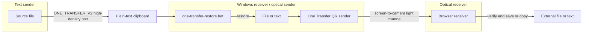
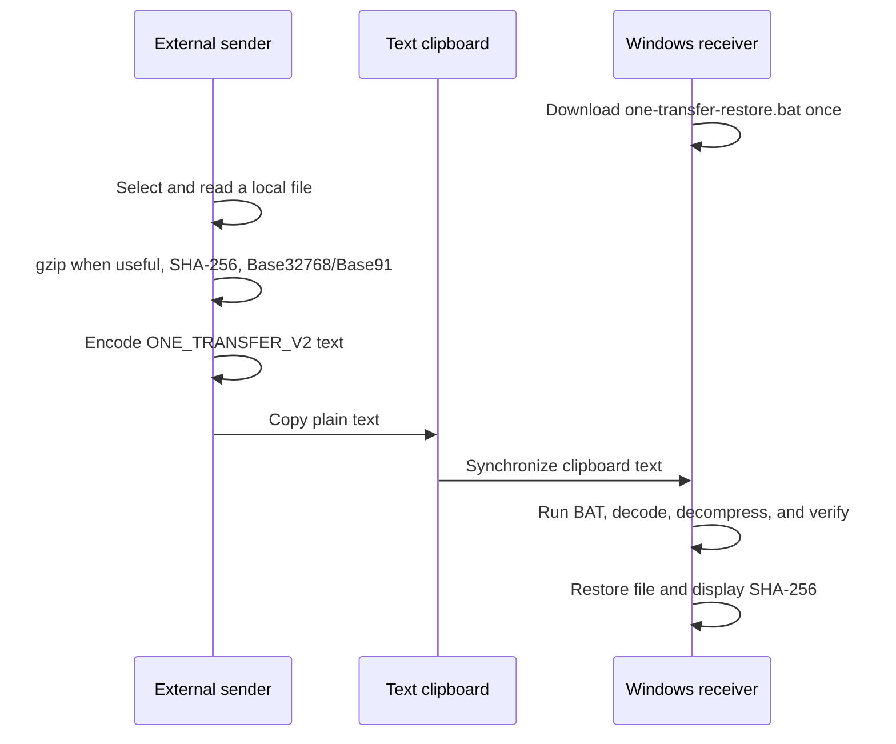
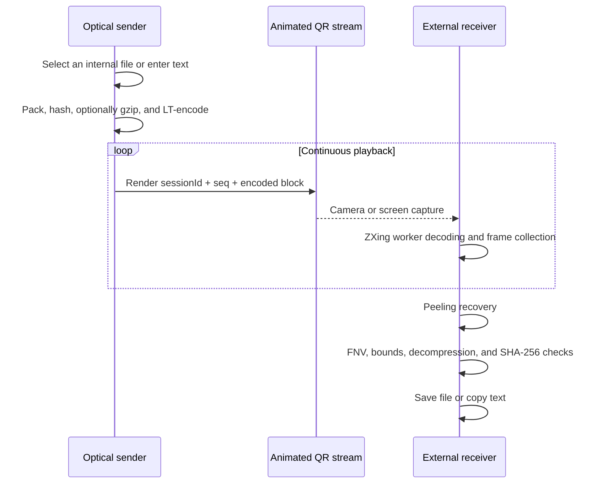

**English** | [简体中文](./README.zh-CN.md)

# One Transfer: A Dual-Channel Data Transfer Scheme

> Transfer data with light.

<p>
  
  
  
  
  
  
  
</p>

Repository: [github.com/zhihui-hu/one-transfer](https://github.com/zhihui-hu/one-transfer)

## ✨ Highlights

- **Optical transfer:** send files and text as LT fountain-coded animated QR frames without a connection between endpoints.
- **Files over text:** gzip when useful, then encode as `ONE_TRANSFER_V2` Base32768 or Base91 and restore it on Windows.
- **Frame-loss tolerance:** recover from any sufficient set of distinct frames without per-frame retransmission.
- **Layered integrity:** validate container structure, lengths, FNV-1a, gzip bounds, and SHA-256.
- **Local processing:** business files never upload to the application server.
- **Offline operation:** PWA caching includes the SPA, worker, WASM decoder, and Windows restorer.
- **Modern UI:** React Router, Tailwind CSS, shadcn/ui, and reduced-motion-aware GSAP transitions.

## 🚀 Quick Start

```bash
git clone https://github.com/zhihui-hu/one-transfer.git
cd one-transfer
pnpm install
pnpm dev
```

Open `https://127.0.0.1:5173`. For a phone or another LAN device, run:

```bash
pnpm dev:lan
```

Production build and full project check:

```bash
pnpm build
pnpm check
```

### One-click Cloudflare Pages Deployment

[](https://deploy.workers.cloudflare.com/?url=https://github.com/zhihui-hu/one-transfer)

If Cloudflare does not detect the project automatically, use:

| Setting | Value |
|---|---|
| Framework preset | `Vite` |
| Build command | `pnpm build` |
| Build output directory | `dist` |
| Node.js | `24` or newer |

## User Guide

### Transfer a File through a Text-only Clipboard

Use this direction when the source side can copy text, the Windows side can paste text, but the channel
does not carry a file object.

1. Open `#/clipboard` on the source device.
2. On the Windows receiver, download `one-transfer-restore.bat` once. Put the script in the directory
   where restored files should be written. The complete source is also visible on the page when direct
   download is inconvenient.
3. The default is **ASCII Compatible** Base91 for Windows, RDP, and channels that may rewrite high
   Unicode. Switch to **High-density Unicode** only when the channel preserves Unicode intact.
4. Select a file. The browser reads it locally, computes SHA-256, tries gzip when appropriate, and shows:
   original size, compressed size, encoded character count, and the estimated reduction from V1 Base64.
5. Click **Copy file data to clipboard**, then switch to the Windows session and wait for clipboard text
   synchronization to finish.
6. Double-click `one-transfer-restore.bat`. The file is written beside the script only after protocol,
   filename, decoded length, gzip bound, and SHA-256 validation all succeed.
7. If the target already exists, move or rename it first. The restorer never overwrites an existing path.

If Windows reports an unrecognized Base32768 character, padding failure, truncation, or SHA-256 failure,
return to the source page, choose **ASCII compatible**, select the same file again, and copy the new Base91
record. Base91 is larger but survives systems that normalize, reject, or re-encode high Unicode.

| Mode | Prefer when | Expected encoding overhead before protocol fields |
|---|---|---:|
| High-density Unicode / Base32768 | Clipboard preserves Unicode; Windows/RDP text path | about 6.67% in UTF-16 |
| ASCII compatible / Base91 | Channel accepts printable ASCII only or Unicode was changed | about 23% |

The 64 MiB application limit is not a promise that every clipboard channel accepts 64 MiB of text.
Remote-desktop products, browser implementations, gateways, and policy layers may impose smaller limits.
V2 detects a truncated record; it cannot increase the underlying channel capacity.

### Transfer a File or Text with Light

1. Open `#/send`, choose **File** or **Text**, and select the content.
2. One Transfer inspects the sending computer and selects the highest Stable/Balanced/Fast preset it can
   reasonably render. The file limit updates with that preset. Lower the slider if the receiving image is
   small, blurred, compressed, or tearing.
3. Keep the four animated QR codes visible. The sender progress bar measures one recommended fountain
   broadcast round; it is not a receiver acknowledgement.
4. On the receiving device, open `#/receive` and choose **Scan computer screen** or **Use camera**.
5. Keep the QR grid inside the capture. The receiver accepts distinct symbols in any order and tolerates
   missing or repeated frames. The receiver progress bar is the authoritative recovery state.
6. Save the file or copy the recovered text only after the page reports successful integrity validation.

### Mac File or Directory Helper

The workspace helper creates the same V2 record and can ZIP a directory before copying it:

```bash
../deploy/add-transfer.sh /path/to/file-or-directory
```

It defaults to Base32768. Use the ASCII fallback when necessary:

```bash
ONE_TRANSFER_CODEC=base91 ../deploy/add-transfer.sh /path/to/file-or-directory
```

The helper requires `python3`, `pbcopy`, and, for directories, `zip`. Directory contents are archived
under one top-level directory so the Windows restorer can validate and move the recovered tree safely.

### Common Problems

| Symptom | Action |
|---|---|
| Base32768 character/padding error | Re-copy with **ASCII compatible** selected |
| SHA-256 or length failure | The text was truncated or changed; copy the whole record again |
| Target already exists | Move or rename the existing file; automatic overwrite is intentionally disabled |
| Clipboard copy button fails | Grant clipboard permission or use a browser that permits clipboard writes in HTTPS |
| QR receiver shows no signal | Lower the speed slider, enlarge the QR window, improve focus, or capture the window directly |
| QR progress is slow but still moving | Keep the stream visible; dropped frames reduce speed, not correctness |

---

## Abstract

One Transfer defines data representations for two asymmetric channel classes. A text-only channel
cannot carry file objects, so the system compresses file bytes when useful, encodes them as UTF-16-efficient
Base32768 text with an ASCII Base91 fallback, and restores the versioned record on Windows. A visible-screen channel has no reliable feedback
path, so the system packages files or text in an integrity-protected container, encodes it as an endless
LT fountain stream, renders animated QR codes, and recovers them through a camera or screen capture.

The implementation is a single-entry Vite SPA. File contents are processed locally in the browser and
are never uploaded to the application server. This document specifies the system model, protocols,
algorithms, security boundary, performance model, implementation, and validation strategy.

**Keywords:** text channel; Base32768; Base91; animated QR; LT fountain code; optical channel; React; Vite

---

## 1. Channel Model and Design Goals

### 1.1 Channel Model

The scheme assumes two primitive channel classes:

1. A **text channel** can carry Unicode text but not a file object.
2. An **optical channel** lets one endpoint display pixels and another observe them, without reliable acknowledgements or retransmission.
3. The sender can read local files and the receiver can persist recovered bytes.

The central problem is independent of a specific business environment: define stable data framing,
loss recovery, integrity checks, and browser lifecycle for those channel capabilities.

### 1.2 Goals

- Convert a file into copyable text and restore its filename, type, and bytes.
- Convert a file or text snippet into an animated QR stream without a handshake.
- Keep all business data processing local to the participating browsers.
- Require no handshake or retransmission channel for optical transfer.
- Verify lengths, container structure, and content digests before exposing recovered data.
- Deploy as a static SPA on Cloudflare Pages, GitHub Pages, or another approved static host.

### 1.3 Example Applications

Any environment that exposes a text channel and a visible screen but makes direct file exchange
inconvenient can combine these transports. Examples include remote desktops, VDI sessions, temporary
isolated endpoints, cross-device offline transfer, and presentation systems. These are examples only;
they do not participate in the protocol definition.

### 1.4 Non-goals

- One Transfer does not provide encryption, sender authentication, authorization, or policy bypass.
- It cannot create a channel when both text clipboard and screen observation are disabled.
- It does not defeat clipboard capacity limits, endpoint auditing, or content inspection.
- It is not a replacement for an organization-approved high-bandwidth file exchange system.

---

## 2. System Model

### 2.1 Participants

| Participant | Location | Responsibility |
|---|---|---|
| Text sender | One endpoint | Select a file and copy its encoded text |
| Windows text receiver / optical sender | Intermediate endpoint | Restore the text payload; display a file or text as QR frames |
| Optical receiver | Another endpoint | Scan, decode, verify, and save or copy content |

The text sender and optical receiver may be the same device or separate devices.

### 2.2 Dual-channel Architecture



| Direction | Payload | Physical channel | Encoding | Receiver |
|---|---|---|---|---|
| Text sender → Windows receiver | File | Clipboard or another text channel | gzip + Base32768/Base91 + SHA-256 | Windows BAT + PowerShell/C# |
| Optical sender → optical receiver | File | Screen → camera/capture | Container + LT code + QR | Browser + ZXing WASM |
| Optical sender → optical receiver | Text | Screen → camera/capture | UTF-8 container + LT code + QR | Browser display and copy |

Inbound ordinary text already fits the available clipboard and needs no additional encoding. The
clipboard file protocol exists specifically because the business object is binary while the permitted
channel is text-only.

---

## 3. SPA Design

### 3.1 Stack

- React 19, Vite 6, and TypeScript 5
- React Router 7 with a persistent `HashRouter` layout
- Tailwind CSS 4 and local shadcn/ui components
- GSAP 3 for loading, route, Tabs, and ambient breathing motion
- `qrcode` for QR generation
- `zxing-wasm` in Web Workers for QR decoding
- `base32768` for UTF-16-efficient clipboard text and an in-project Base91 fallback
- `vite-plugin-pwa` for offline precaching
- Web Crypto, Compression Streams, Media Capture, Canvas, and Clipboard APIs

### 3.2 Routes

The application has one HTML entry point:

| Route | Purpose |
|---|---|
| `#/` | Channel selection |
| `#/send` | Display an internal file or text snippet as animated QR frames |
| `#/receive` | Receive through screen capture or a camera |
| `#/clipboard` | Encode an inbound file as clipboard text and download the Windows restorer |

React Router's hash routing requires no server-side rewrite. The parent layout remains mounted while
each child route mounts exactly one page and its transfer controller. Leaving the send route stops QR
animation. Leaving the receive route closes camera or screen capture, terminates decoder workers, and
clears timers before the page unmounts.

The HTML entry contains only a critical inline boot screen. React keeps application content hidden until
the transfer controllers are mounted, then GSAP removes the loader and reveals the route. Route changes
use a GSAP timeline, the send-mode Tabs use a moving GSAP indicator, and a low-opacity ambient orb adds
breathing motion. All motion is disabled when `prefers-reduced-motion` is enabled.

### 3.3 Offline Operation

The production service worker precaches the SPA, JavaScript, CSS, ZXing WASM, decoder worker, and
`one-transfer-restore.bat`. Once loaded, the application can continue operating without a network. A strictly
isolated deployment should be cached before entering the boundary or hosted on an approved internal
static service.

---

## 4. Inbound File Transfer over a Text Clipboard

### 4.1 Sender Processing

On `#/clipboard`, the external sender:

1. Validates that the selected filename can be created on Windows.
2. Reads bytes locally through `File.arrayBuffer()`.
3. Computes SHA-256 and tries gzip for data that is not already compressed.
4. Encodes the transmitted bytes as Base32768 by default, or Base91 in ASCII compatibility mode.
5. Constructs `ONE_TRANSFER_V2` and writes the text to the clipboard without rendering the payload.
6. Uses a temporary text area with `execCommand` when the modern Clipboard API is unavailable.

Base32768 places 15 input bits in one safe BMP character. In a UTF-16 text channel this is 93.75%
efficient, or approximately 6.67% overhead, and uses about 40% as many characters as Base64. Base91
uses printable ASCII with about 23% overhead and is the fallback for channels that alter high Unicode.
The UI reports original and compressed size, final character count, and the approximate reduction from
the V1 Base64 representation.

### 4.2 Clipboard Wire Format

The V2 record is one text value split into eight fields; the eighth field consumes the remainder so a
Base91 payload may contain `|` safely:

```text
ONE_TRANSFER_V2|<itemType>|<codec>|<compression>|<originalSize>|<sha256>|<percentEncodedName>|<payload>
```

| Field | Meaning |
|---|---|
| `ONE_TRANSFER_V2` | Protocol magic and version |
| `itemType` | `file` or `directory` |
| `codec` | `b32768` or `base91` |
| `compression` | `none` or `gzip` |
| `originalSize` | Exact decoded byte count, bounded to 64 MiB |
| `sha256` | Lowercase SHA-256 of the original bytes |
| name | Percent-encoded UTF-8 basename |
| payload | Encoded original bytes, gzip stream, or directory ZIP |

The web UI handles one file per operation. On a Mac sender, a directory can be prepared with
`../deploy/add-transfer.sh <directory>`; the helper creates a ZIP and emits V2 Base32768. Set
`ONE_TRANSFER_CODEC=base91` for ASCII compatibility. The Windows receiver still accepts legacy
`ONE_TRANSFER_V1` Base64 records generated before this upgrade.

### 4.3 Windows Restoration

The Windows receiver can download `one-transfer-restore.bat` from `#/clipboard`, or copy the complete script
source displayed on the page and save it under that filename. Place it in the desired destination
directory. On each run, the script:

1. Checks for Windows PowerShell.
2. reads clipboard text using `Get-Clipboard -Raw`;
3. identifies V1 or V2 and validates every field before allocating output;
4. decodes Base32768/Base91 through an embedded compiled C# codec, or Base64 for V1 compatibility;
5. inflates gzip with the declared original size as a hard output ceiling;
6. verifies exact byte length and SHA-256 before writing anything;
7. refuses to overwrite an existing target;
8. writes a file directly or expands a directory ZIP in randomized temporary paths;
9. prints SHA-256, cleans temporary data, and pauses so the result remains visible.

Clipboard text is never evaluated as a command. The decoded filename is used only as a validated path
argument. Clipboard payload bytes are treated as untrusted until length and digest verification finish.

### 4.4 Inbound Sequence



### 4.5 Compression Pipeline and Size Reduction

The clipboard sender performs transformations in this order:

```text
original bytes
  ├─ SHA-256(original)
  └─ optional gzip
       └─ Base32768 or Base91
            └─ ONE_TRANSFER_V2 header + encoded payload
```

The web sender considers gzip only when the item is a file, its size is at least 768 bytes, and its MIME
type is not known to be already compressed. Even then, gzip is accepted only when:

```text
gzipSize + 64 < originalSize
```

The 64-byte margin prevents spending decoder work and protocol complexity for a negligible result.
Video, ZIP/gzip/7z/RAR/xz/zstd, most JPEG/PNG/WebP-style images, compressed audio, Office Open XML, and
OpenDocument files skip the trial. BMP, SVG, TIFF, WAV, AIFF, plain text, JSON, source code, CSV, XML,
and logs remain eligible. The Mac helper calculates gzip and makes the same 64-byte gain decision.

Let `N` be original bytes, `C` the selected transmitted bytes after optional gzip, and `H` the V2 header
and encoded filename character count. Approximate text lengths are:

```text
Base32768 characters ≈ ceil(8 × C / 15) + H
Base91 characters    ≈ 1.23 × C + H
legacy Base64        ≈ 4 × ceil(N / 3) + legacyHeader
```

Base32768 is smaller by character count and by UTF-16 storage. If an intermediary converts everything
to UTF-8 and applies a byte quota, its BMP characters normally occupy three UTF-8 bytes; Base91 may then
be the smaller wire representation despite having more visible characters. Use the channel's actual
limit and behavior, not only the string length shown by the browser.

To minimize the transferred text:

1. Use **High-density Unicode** unless the real channel changes Unicode or is explicitly ASCII-only.
2. Let One Transfer gzip text-like files automatically; pre-zipping one ordinary text file is usually
   unnecessary and removes MIME information that helps the UI explain the decision.
3. Do not repeatedly recompress JPEG, PNG, WebP, MP4, ZIP, 7z, RAR, Office, or other entropy-coded files.
   They normally cannot shrink further; Base32768 still reduces the text-encoding overhead.
4. Remove generated caches, build output, debug logs, or other unnecessary content before creating an
   archive. Compression cannot remove data that is not needed in the first place.
5. For a directory, use the Mac helper to create one ZIP rather than transferring many files separately.
6. If the concrete clipboard limit is below the final V2 character count, split the source into smaller
   files before encoding. V2 currently restores one complete record and does not implement multipart state.

Restoration reverses the pipeline: text decode → bounded gzip expansion → exact length check → SHA-256
check → write. The script does not trust the gzip trailer or protocol size alone and writes nothing when
any stage fails.

---

## 5. Data-to-Light Optical Transfer

### 5.1 Unified File Container

Files and text snippets share one optical container. Text is UTF-8 encoded and identified with the
compatibility media type `application/vnd.decimen.snippet`; the receiver uses it to choose between a
download control and a copyable text result.

The fixed little-endian container header is 49 bytes:

| Offset | Length | Field | Description |
|---:|---:|---|---|
| 0 | 4 | Magic | ASCII `DCF2` |
| 4 | 1 | Compression | `0` none, `1` gzip |
| 5 | 2 | Name length | UTF-8 filename byte length |
| 7 | 2 | Type length | MIME type byte length |
| 9 | 4 | Original length | Original payload length |
| 13 | 4 | Transmitted length | Optical payload length |
| 17 | 32 | SHA-256 | Digest of original bytes |
| 49 | variable | Name + type + payload | Container body |

The optical file limit is derived from the active preset's bytes per symbol, the 20-byte frame header,
and the `u16` source-block count: about 90.2 MiB for Stable, 104.9 MiB for Balanced, and 144.3 MiB for
Fast. Text snippets remain limited to 4 MiB and clipboard files to 64 MiB. Compressible data is tested
with gzip, while JPEG, video, ZIP, Office Open XML, and other precompressed types skip the extra
allocation and CPU pass. Gzip is selected only when it saves more than 64 bytes.

The receiver streams decompression and enforces the declared original length as a hard output ceiling;
it does not trust the gzip trailer as a safe allocation bound.

### 5.2 LT Fountain Coding

A screen-to-camera link has no practical retransmission channel. One Transfer uses an LT fountain code:

1. Split the container into `K` equal source blocks and zero-pad the final block.
2. Derive a degree `d` from each sequence number.
3. Select `d` distinct source blocks using a robust soliton distribution.
4. XOR those blocks into one encoded block.
5. Continue generating new sequence numbers indefinitely.
6. Recover source blocks with a peeling decoder after enough distinct frames arrive.

The robust-soliton parameters are `c = 0.1` and `δ = 0.5`. Sender and receiver must derive identical
block subsets for a given `sessionId + seq`. Because native `Math.log` may differ by one ULP across
JavaScript engines, the implementation uses a deterministic logarithm built from specified IEEE-754
operations and pins its output with golden-vector tests.

Dropped frames reduce throughput but do not invalidate the transfer. The receiver can join a stream
midway and does not need to tell the sender which frames were lost.

### 5.3 QR Frame Header

Each QR frame contains a 20-byte little-endian header followed by one encoded block:

| Offset | Type | Field | Description |
|---:|---|---|---|
| 0 | `u8` | Magic 0 | `0xD1` |
| 1 | `u8` | Magic 1 | `0x0C` |
| 2 | `u16` | Session ID | Random per sender start |
| 4 | `u32` | Sequence | Fountain subset input |
| 8 | `u16` | K | Source block count |
| 10 | `u16` | Block length | Encoded bytes per frame |
| 12 | `u32` | Total length | Full container size |
| 16 | `u32` | Payload FNV-1a | Fast recovered-container check |
| 20 | variable | Encoded block | Fountain XOR output |

The high-throughput layout keeps four independently decodable QR symbols visible, but replaces only one
cell on each visual tick. The Balanced preset emits 60 symbols per second at 1465 bytes per symbol; the
20-byte header leaves a 1445-byte encoded block. QR error-correction level L is used. A single shadcn/ui
speed slider combines the frame-size and tick-rate choices into Stable, Balanced, and Fast presets;
difficult displays or cameras should move it toward the minimum.

On the send page, One Transfer first inspects the capabilities the browser may expose: logical CPU
count, approximate device memory, measured animation refresh rate, and the shorter viewport edge. It
then applies the highest preset whose complete requirements are met:

| Preset | Local recommendation boundary | Raw model |
|---|---|---:|
| Stable | Constrained CPU, refresh rate, or physical pixels | about 20 KiB/s |
| Balanced | 4+ logical CPUs, about 45+ Hz, 1200px+ physical short edge | about 85 KiB/s |
| Fast | 8+ logical CPUs, about 55+ Hz, 1800px+ physical short edge | about 135 KiB/s |

Missing privacy-restricted values, such as `deviceMemory` in some browsers, do not automatically lower
the recommendation. The result and its evidence are shown under the slider. This inspection covers the
sending computer only; receiver camera quality, remote-desktop compression, and receiver CPU remain
unknown, so the user can always lower the preset manually.

### 5.4 Capture and Decode

The external receiver supports:

- `getDisplayMedia` for direct window or screen capture;
- `getUserMedia` for a phone or external camera;
- a preview container that follows the track's actual aspect ratio instead of letterboxing portrait video;
- Canvas downsampling before decoding large desktop frames;
- a ZXing WASM worker pool that searches the complete centred frame for up to four symbols on the fast
  path, with rotate, invert, downscale, denoise, and `tryHarder` enabled only after repeated misses;
- a fast ZXing path on ordinary frames, with expensive rotate, invert, downscale, denoise, and
  `tryHarder` searches enabled only as a sparse robust fallback after repeated misses;
- frame dropping when all workers are busy;
- generation counters that invalidate callbacks from stopped media streams.

After fountain recovery, the receiver checks FNV-1a, parses and bounds-checks the container, optionally
decompresses it, and verifies SHA-256. A download or copy control is shown only after all checks pass.

### 5.5 Outbound Sequence



---

## 6. Text Transfer

Inbound ordinary text should use the existing plain-text clipboard directly. Outbound text is entered
on `#/send`, encoded as UTF-8 in the same container and fountain stream, and reconstructed by the same
receiver. The text limit is 4 MiB. Recovered text is held only in the page and is not persisted.

---

## 7. Integrity and Security Boundary

### 7.1 Integrity Layers

| Layer | Mechanism | Purpose |
|---|---|---|
| QR | QR error correction | Local visual damage within one frame |
| Optical stream | LT fountain code | Frame loss, duplication, and reordering |
| Recovered container | FNV-1a | Fast accidental-corruption check |
| Original content | SHA-256 | Final content verification |
| Clipboard restore | Declared length + SHA-256 | Reject truncation or mutation before writing |

FNV-1a is a fast error-detection aid, not authentication. SHA-256 confirms content equality, but the
digest and payload arrive through the same unauthenticated channel.

### 7.2 Defensive Measures

- Basename-only filenames with control-character and Windows reserved-name rejection.
- No overwrite of an existing Windows target.
- Random temporary paths and cleanup for directory restoration.
- Hard gzip decompression output ceiling.
- Completed optical sessions are ignored until a new stream identity appears.
- Camera, capture, workers, and timers stop when the SPA receive route is left.
- Loading text uses a reduced-motion-aware sweep-shine fallback.

### 7.3 Explicit Risks

- Encoded clipboard data and QR frames contain the original information and are not confidential.
- Anyone able to write the clipboard or place a QR stream in view can provide input.
- The runtime environment, endpoint software, or operating system may audit clipboard and screen activity.
- Any camera able to see the sender screen can potentially receive the optical stream.
- Clipboard size limits can truncate large text records; V2 detects this but cannot raise the limit.

For sensitive material, encrypt the file with an organization-approved tool before transferring it.

---

## 8. Performance Model

### 8.1 Clipboard Channel

For uncompressed bytes, Base32768 adds approximately 6.67% in a UTF-16 channel and emits about 0.533
characters per input byte. Base91 adds about 23% but is printable ASCII. Base32768 can be worse when an
intermediate service charges UTF-8 bytes rather than Unicode characters or UTF-16 code units, which is
why V2 exposes both modes. Gzip is attempted first and often dominates the encoding difference for
text, JSON, source code, and logs. Both endpoints still hold original, transmitted, and decoded data,
so the practical limit remains lower than the browser's theoretical memory ceiling.

### 8.2 Optical Channel

The sender keeps four QR symbols visible but replaces only one on each visual tick. Every cell remains
stable for four update periods, so a rolling-shutter transition cannot corrupt the whole grid at once:

```text
symbolsPerSecond = symbolsPerTick × ticksPerSecond
rawKiB/s = symbolsPerSecond × (frameBytes - headerBytes) / 1024
netKiB/s ≈ rawKiB/s × decodeSuccessRate / fountainOverhead
```

The Balanced values are `1 × 60 = 60` symbols/s and `blockLength = 1465 - 20 = 1445` bytes, for a
raw payload ceiling of `84.66796875 KiB/s`. This is a model, not a benchmark. For example:

| Decoded unique symbols | Fountain overhead | Estimated net goodput |
|---:|---:|---:|
| 100% | 1.15× | 73.6 KiB/s |
| 75% | 1.20× | 52.9 KiB/s |
| 50% | 1.30× | 32.6 KiB/s |

Real throughput depends on display refresh, tearing, exposure, autofocus, distance, ambient light,
moiré patterns, video compression, decoder speed, and fountain redundancy. The fast ZXing path avoids
paying for difficult-image searches on every frame; a robust pass is attempted only after repeated fast
misses. A denser QR frame is not always faster, and reducing density or tick rate can raise end-to-end
goodput when recognition is unstable.

The optical link is intentionally one-way, so the sender cannot perform feedback-based FPS adaptation.
If a remote desktop or capture stream delivers fewer than 30 visual frames per second, the receiver sees
missing or repeated symbols: completion takes longer, but LT recovery and the final checksum prevent a
damaged file from being accepted. The receiver starts 2–4 decode workers from the available logical CPU
count and can grow the pool when workers remain saturated. For a persistently weak image, moving the
single speed slider to its minimum selects the 700-byte / 30-tick Stable preset.

The current wire protocol still uses the existing LT fountain code. RaptorQ is a future option for
lower and more predictable recovery overhead, but adopting it requires a versioned protocol change and
is not part of the present four-QR throughput update.

The sender progress bar measures one recommended broadcast round: emitted symbols divided by the LT
target derived from `K` and the expected fountain overhead. It repeats because the one-way sender cannot
know when the receiver has finished. The receiver progress bar is the authoritative recovery progress;
it combines unique frame count, expected overhead, and solved blocks, and never reports 100% before
final verification.

---

## 9. Repository Structure

```text
one-transfer/
├── index.html                 # Minimal Vite entry and critical boot screen
├── src/
│   ├── main.tsx               # React root and HashRouter
│   ├── app.tsx                # Persistent routes, views, loading, and GSAP
│   ├── styles.css             # Tailwind entry and dynamic controller styles
│   ├── components/            # Build info, update checker, and local shadcn/ui
│   ├── lib/device-capabilities.ts # Browser capability inspection
│   └── lib/utils.ts           # shadcn/ui class merging helper
├── send/main.ts               # Container creation, LT encoding, QR playback
├── receive/
│   ├── main.ts                # Capture, progress, recovery, result UI
│   ├── worker.ts              # ZXing WASM decode worker
│   ├── worker-factory.ts      # Worker construction
│   └── wasm-url.ts            # Decoder WASM asset URL
├── clipboard/main.ts          # Browser file-to-text clipboard sender
├── shared/                    # Protocols, fountain code, validation, utilities
├── public/                    # Windows receiver and update-check Worker
├── .github/workflows/         # GitHub Pages and Cloudflare Pages deployment
├── tests/                     # Golden vectors and unit tests
├── vite.config.ts             # SPA, HTTPS development, and PWA configuration
└── wrangler.toml              # Cloudflare Pages configuration
```

`../deploy/add-transfer.sh` is a workspace-level Mac helper and is not part of the SPA build. It shares
the `ONE_TRANSFER_V2` Base32768/Base91 protocol with the browser implementation.

---

## 10. Development and Deployment

### 10.1 Requirements

- Node.js 24+
- pnpm 10
- A modern browser with WebAssembly, Media Capture, and Web Worker support
- Windows PowerShell with `Get-Clipboard` on the inbound receiver

### 10.2 Commands

```bash
pnpm install
pnpm dev          # localhost only; prints one address
pnpm dev:lan      # all interfaces; use for phones and LAN receivers
pnpm test         # protocol, fountain, progress, and clipboard tests
pnpm build        # type-check and build SPA/PWA into dist/
pnpm preview      # localhost production preview
pnpm preview:lan  # LAN production preview
pnpm check        # tests followed by production build
```

`pnpm dev` binds to `127.0.0.1`. `pnpm dev:lan` intentionally lists every active Wi-Fi, VPN, virtual
machine, and tunnel address; they all point to the same Vite process. LAN camera use requires HTTPS.
The development certificate is self-signed and must be explicitly accepted on each test device.

### 10.3 Cloudflare Pages

The `cloudflare-pages` job in `pages.yml` reuses the tested site artifact. A push to `main` or a manual
dispatch deploys `dist/` with Wrangler. Configure these repository secrets:

- `CLOUDFLARE_API_TOKEN`, limited to Cloudflare Pages edit access;
- `CLOUDFLARE_ACCOUNT_ID`.

Local deployment remains available:

```bash
make deploy
```

The Makefile loads local Cloudflare credentials from `.env`, builds `dist/`, and deploys the Wrangler
project `one-transfer`.

### 10.4 GitHub Pages Automation

The same `pages.yml` workflow tests and builds once, then deploys the artifact independently to GitHub
Pages and Cloudflare Pages. In repository **Settings → Pages**, keep
**Source** set to **GitHub Actions**.

### 10.5 Build Version and Update Checks

Vite embeds the package version, build time, and Git commit in the application and emits the same data
as `dist/version.json`. `BuildInfo` prints the values once in the developer console, while the footer
shows the version and short commit. A small same-origin Worker checks `version.json` on startup, when
the tab becomes visible, and every five minutes. A changed version or commit displays an explicit update
notice; the existing PWA service worker still owns cache replacement and controller activation.

---

## 11. Validation

Automated coverage includes:

- clipboard fields, Unicode names, empty files, and Windows filename rules;
- optical containers, gzip decisions, SHA-256, malformed data, and decompression bounds;
- golden vectors for the 20-byte QR header;
- deterministic log, robust soliton distribution, and block-index generation;
- LT recovery with out-of-order, duplicate, and 30% dropped frames;
- frame capacity, display sizing, progress estimates, no-signal behavior, and worker lifecycle;
- automatic device recommendations for constrained, balanced, and capable senders;
- four-symbol throughput calculations, batched worker results, and decoder performance counters;
- complete file and UTF-8 text round trips.

A production check must also confirm that `dist/` contains one `index.html`, `version.json` matches the
embedded build version, the service worker caches the Workers/WASM/Windows script, and the public BAT
matches the workspace deployment copy. A real Windows clipboard import and a real optical export remain
runtime checks that static builds cannot replace.

---

## 12. Limitations and Future Work

- Add clipboard chunking, sequence numbers, and per-segment checksums.
- Add an optional approved encryption and sender-authentication layer.
- Provide a signed PowerShell or executable Windows receiver.
- Add measured device presets and optional sender/receiver feedback when a return channel is available.
- Build a performance matrix across text channels, browsers, cameras, and displays.
- Add browser-side directory packaging.

---

## 13. Conclusion

One Transfer combines two permitted but asymmetric channels into a complete restricted-desktop data
flow. External files enter as gzip/Base32768 or Base91 V2 text through a clipboard; internal files and text leave as animated
fountain-coded QR frames. The text channel solves the text-only inbound constraint, while fountain
coding makes a lossy, one-way optical channel practical.

The system provides local processing, frame-loss tolerance, and content-integrity checks. It does not
provide confidentiality or identity. It should be used only where the organization explicitly permits
the underlying text clipboard and visible-screen channels.

---

## References

1. M. Luby, “LT Codes,” *Proceedings of the 43rd Annual IEEE Symposium on Foundations of Computer Science*, 2002.
2. ISO/IEC 18004, *Information technology — Automatic identification and data capture techniques — QR Code bar code symbology specification*.
3. NIST FIPS PUB 180-4, *Secure Hash Standard (SHS)*.
4. P. Deutsch, RFC 1952, *GZIP File Format Specification version 4.3*, 1996.
5. W3C, *Media Capture and Streams* and *Screen Capture* specifications.
6. `zxing-wasm`, [Reader API and decoding options](https://github.com/Sec-ant/zxing-wasm#reader-api).
7. `zxing-cpp`, [WebAssembly performance notes](https://github.com/zxing-cpp/zxing-cpp/tree/master/wrappers/wasm).
8. `RaptorQR`, [multi-QR optical-transfer implementation and benchmarks](https://github.com/infrost/RaptorQR).
9. `base32768`, [UTF-16-efficient binary-to-text encoding](https://github.com/qntm/base32768).
10. M. Botta et al., [“A Survey of Printable Encodings,” Algorithms 18(8), 2025](https://doi.org/10.3390/a18080504).

## License

This project is released under the [MIT License](./LICENSE). Issues and pull requests are welcome at
[github.com/zhihui-hu/one-transfer](https://github.com/zhihui-hu/one-transfer).

The optical protocol and fountain-code implementation evolved from BashAlarmist's Decimen Optical
Transfer. See [LICENSE](./LICENSE) and [NOTICE](./NOTICE) for attribution and contributor notices.
