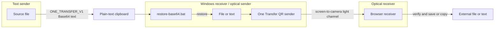
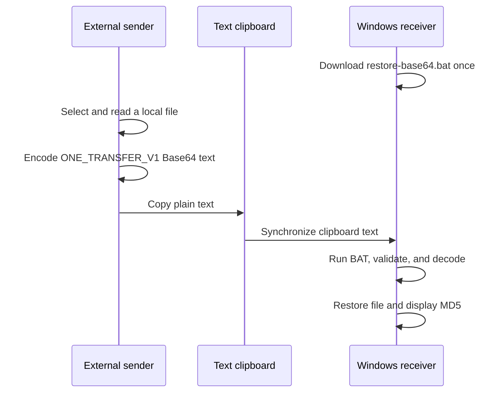
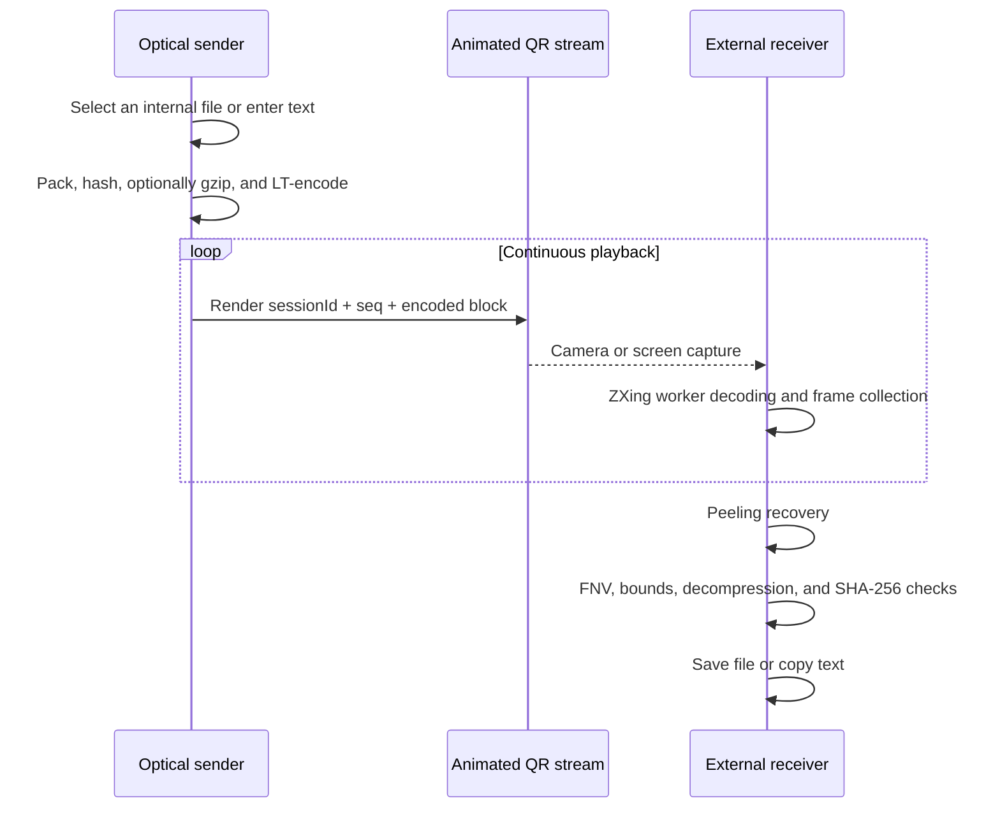

**English** | [简体中文](./README.zh-CN.md)

# One Transfer: A Dual-Channel Data Transfer Scheme

> Transfer data with light.

<p>
  
  
  
  
  
  
  
</p>

Repository: [github.com/zhihui-hu/one-transfer](https://github.com/zhihui-hu/one-transfer)

## ✨ Highlights

- **Optical transfer:** send files and text as LT fountain-coded animated QR frames without a connection between endpoints.
- **Files over text:** encode a file as a versioned `ONE_TRANSFER_V1` Base64 record and restore it on Windows.
- **Frame-loss tolerance:** recover from any sufficient set of distinct frames without per-frame retransmission.
- **Layered integrity:** validate container structure, lengths, FNV-1a, gzip bounds, and SHA-256.
- **Local processing:** business files never upload to the application server.
- **Offline operation:** PWA caching includes the SPA, worker, WASM decoder, and Windows restorer.
- **Modern UI:** React Router, Tailwind CSS, shadcn/ui, and reduced-motion-aware GSAP transitions.

## 🚀 Quick Start

```bash
git clone https://github.com/zhihui-hu/one-transfer.git
cd one-transfer
pnpm install
pnpm dev
```

Open `https://127.0.0.1:5173`. For a phone or another LAN device, run:

```bash
pnpm dev:lan
```

Production build and full project check:

```bash
pnpm build
pnpm check
```

### One-click Cloudflare Pages Deployment

[](https://deploy.workers.cloudflare.com/?url=https://github.com/zhihui-hu/one-transfer)

If Cloudflare does not detect the project automatically, use:

| Setting | Value |
|---|---|
| Framework preset | `Vite` |
| Build command | `pnpm build` |
| Build output directory | `dist` |
| Node.js | `24` or newer |

---

## Abstract

One Transfer defines data representations for two asymmetric channel classes. A text-only channel
cannot carry file objects, so the system encodes file bytes, a UTF-8 filename, and type information as a
versioned Base64 record and restores it on Windows. A visible-screen channel has no reliable feedback
path, so the system packages files or text in an integrity-protected container, encodes it as an endless
LT fountain stream, renders animated QR codes, and recovers them through a camera or screen capture.

The implementation is a single-entry Vite SPA. File contents are processed locally in the browser and
are never uploaded to the application server. This document specifies the system model, protocols,
algorithms, security boundary, performance model, implementation, and validation strategy.

**Keywords:** text channel; Base64; animated QR; LT fountain code; optical channel; React; Vite

---

## 1. Channel Model and Design Goals

### 1.1 Channel Model

The scheme assumes two primitive channel classes:

1. A **text channel** can carry Unicode text but not a file object.
2. An **optical channel** lets one endpoint display pixels and another observe them, without reliable acknowledgements or retransmission.
3. The sender can read local files and the receiver can persist recovered bytes.

The central problem is independent of a specific business environment: define stable data framing,
loss recovery, integrity checks, and browser lifecycle for those channel capabilities.

### 1.2 Goals

- Convert a file into copyable text and restore its filename, type, and bytes.
- Convert a file or text snippet into an animated QR stream without a handshake.
- Keep all business data processing local to the participating browsers.
- Require no handshake or retransmission channel for optical transfer.
- Verify lengths, container structure, and content digests before exposing recovered data.
- Deploy as a static SPA on Cloudflare Pages, GitHub Pages, or another approved static host.

### 1.3 Example Applications

Any environment that exposes a text channel and a visible screen but makes direct file exchange
inconvenient can combine these transports. Examples include remote desktops, VDI sessions, temporary
isolated endpoints, cross-device offline transfer, and presentation systems. These are examples only;
they do not participate in the protocol definition.

### 1.4 Non-goals

- One Transfer does not provide encryption, sender authentication, authorization, or policy bypass.
- It cannot create a channel when both text clipboard and screen observation are disabled.
- It does not defeat clipboard capacity limits, endpoint auditing, or content inspection.
- It is not a replacement for an organization-approved high-bandwidth file exchange system.

---

## 2. System Model

### 2.1 Participants

| Participant | Location | Responsibility |
|---|---|---|
| Text sender | One endpoint | Select a file and copy its encoded text |
| Windows text receiver / optical sender | Intermediate endpoint | Restore the text payload; display a file or text as QR frames |
| Optical receiver | Another endpoint | Scan, decode, verify, and save or copy content |

The text sender and optical receiver may be the same device or separate devices.

### 2.2 Dual-channel Architecture



| Direction | Payload | Physical channel | Encoding | Receiver |
|---|---|---|---|---|
| Text sender → Windows receiver | File | Clipboard or another text channel | Base64 text protocol | Windows BAT + PowerShell |
| Optical sender → optical receiver | File | Screen → camera/capture | Container + LT code + QR | Browser + ZXing WASM |
| Optical sender → optical receiver | Text | Screen → camera/capture | UTF-8 container + LT code + QR | Browser display and copy |

Inbound ordinary text already fits the available clipboard and needs no additional encoding. The
clipboard file protocol exists specifically because the business object is binary while the permitted
channel is text-only.

---

## 3. SPA Design

### 3.1 Stack

- React 19, Vite 6, and TypeScript 5
- React Router 7 with a persistent `HashRouter` layout
- Tailwind CSS 4 and local shadcn/ui components
- GSAP 3 for loading, route, Tabs, and ambient breathing motion
- `qrcode` for QR generation
- `zxing-wasm` in Web Workers for QR decoding
- `vite-plugin-pwa` for offline precaching
- Web Crypto, Compression Streams, Media Capture, Canvas, and Clipboard APIs

### 3.2 Routes

The application has one HTML entry point:

| Route | Purpose |
|---|---|
| `#/` | Channel selection |
| `#/send` | Display an internal file or text snippet as animated QR frames |
| `#/receive` | Receive through screen capture or a camera |
| `#/clipboard` | Encode an inbound file as clipboard text and download the Windows restorer |

React Router's hash routing requires no server-side rewrite. The parent layout remains mounted while
each child route mounts exactly one page and its transfer controller. Leaving the send route stops QR
animation. Leaving the receive route closes camera or screen capture, terminates decoder workers, and
clears timers before the page unmounts.

The HTML entry contains only a critical inline boot screen. React keeps application content hidden until
the transfer controllers are mounted, then GSAP removes the loader and reveals the route. Route changes
use a GSAP timeline, the send-mode Tabs use a moving GSAP indicator, and a low-opacity ambient orb adds
breathing motion. All motion is disabled when `prefers-reduced-motion` is enabled.

### 3.3 Offline Operation

The production service worker precaches the SPA, JavaScript, CSS, ZXing WASM, decoder worker, and
`restore-base64.bat`. Once loaded, the application can continue operating without a network. A strictly
isolated deployment should be cached before entering the boundary or hosted on an approved internal
static service.

---

## 4. Inbound File Transfer over a Text Clipboard

### 4.1 Sender Processing

On `#/clipboard`, the external sender:

1. Validates that the selected filename can be created on Windows.
2. Reads bytes locally through `File.arrayBuffer()`.
3. Base64-encodes the UTF-8 filename and raw payload.
4. Constructs a `ONE_TRANSFER_V1` record.
5. Writes the record through the Clipboard API, with a legacy text-area fallback.

For a file of `N` bytes, Base64 requires approximately:

```text
B = 4 × ceil(N / 3)
```

The resulting text is therefore about 1.33 times the original size before protocol and filename
overhead. The practical limit is determined by the browser and the capacity of the concrete text channel.

### 4.2 Clipboard Wire Format

The record is a single text line split into at most four fields:

```text
ONE_TRANSFER_V1|<itemType>|<base64(UTF-8 name)>|<base64(payload)>
```

| Field | Meaning |
|---|---|
| `ONE_TRANSFER_V1` | Protocol magic and version |
| `itemType` | `file` or `directory` |
| name | Base64-encoded UTF-8 basename |
| payload | Base64-encoded file bytes or directory ZIP |

The web UI handles one file per operation. On a Mac sender, a directory can be prepared with
`../deploy/add-transfer.sh <directory>`; the helper creates a ZIP and emits the same wire format.

### 4.3 Windows Restoration

The Windows receiver downloads `restore-base64.bat` from `#/clipboard` and places it in the desired
destination directory. On each run, the script:

1. Checks for Windows PowerShell.
2. reads clipboard text using `Get-Clipboard -Raw`;
3. validates protocol magic, field count, item type, and filename;
4. decodes the Base64 filename and payload;
5. refuses to overwrite an existing target;
6. writes a file directly or expands a directory ZIP in randomized temporary paths;
7. prints an MD5 value, cleans temporary data, and pauses so the result remains visible.

Clipboard text is never evaluated as a command. The decoded filename is used only as a validated path
argument.

### 4.4 Inbound Sequence



---

## 5. Data-to-Light Optical Transfer

### 5.1 Unified File Container

Files and text snippets share one optical container. Text is UTF-8 encoded and identified with the
compatibility media type `application/vnd.decimen.snippet`; the receiver uses it to choose between a
download control and a copyable text result.

The fixed little-endian container header is 49 bytes:

| Offset | Length | Field | Description |
|---:|---:|---|---|
| 0 | 4 | Magic | ASCII `DCF2` |
| 4 | 1 | Compression | `0` none, `1` gzip |
| 5 | 2 | Name length | UTF-8 filename byte length |
| 7 | 2 | Type length | MIME type byte length |
| 9 | 4 | Original length | Original payload length |
| 13 | 4 | Transmitted length | Optical payload length |
| 17 | 32 | SHA-256 | Digest of original bytes |
| 49 | variable | Name + type + payload | Container body |

Files are limited to 64 MiB and text snippets to 4 MiB. Compressible data is tested with gzip, while
JPEG, video, ZIP, Office Open XML, and other precompressed types skip the extra allocation and CPU pass.
Gzip is selected only when it saves more than 64 bytes.

The receiver streams decompression and enforces the declared original length as a hard output ceiling;
it does not trust the gzip trailer as a safe allocation bound.

### 5.2 LT Fountain Coding

A screen-to-camera link has no practical retransmission channel. One Transfer uses an LT fountain code:

1. Split the container into `K` equal source blocks and zero-pad the final block.
2. Derive a degree `d` from each sequence number.
3. Select `d` distinct source blocks using a robust soliton distribution.
4. XOR those blocks into one encoded block.
5. Continue generating new sequence numbers indefinitely.
6. Recover source blocks with a peeling decoder after enough distinct frames arrive.

The robust-soliton parameters are `c = 0.1` and `δ = 0.5`. Sender and receiver must derive identical
block subsets for a given `sessionId + seq`. Because native `Math.log` may differ by one ULP across
JavaScript engines, the implementation uses a deterministic logarithm built from specified IEEE-754
operations and pins its output with golden-vector tests.

Dropped frames reduce throughput but do not invalidate the transfer. The receiver can join a stream
midway and does not need to tell the sender which frames were lost.

### 5.3 QR Frame Header

Each QR frame contains a 20-byte little-endian header followed by one encoded block:

| Offset | Type | Field | Description |
|---:|---|---|---|
| 0 | `u8` | Magic 0 | `0xD1` |
| 1 | `u8` | Magic 1 | `0x0C` |
| 2 | `u16` | Session ID | Random per sender start |
| 4 | `u32` | Sequence | Fountain subset input |
| 8 | `u16` | K | Source block count |
| 10 | `u16` | Block length | Encoded bytes per frame |
| 12 | `u32` | Total length | Full container size |
| 16 | `u32` | Payload FNV-1a | Fast recovered-container check |
| 20 | variable | Encoded block | Fountain XOR output |

The default frame size is 2953 bytes, leaving a 2933-byte encoded block after the header. The default is
60 FPS with QR error-correction level L. Difficult displays or cameras should reduce the frame size to
1465 and the frame rate to 24 FPS.

### 5.4 Capture and Decode

The external receiver supports:

- `getDisplayMedia` for direct window or screen capture;
- `getUserMedia` for a phone or external camera;
- Canvas downsampling before decoding large desktop frames;
- a ZXing WASM worker pool;
- frame dropping when all workers are busy;
- generation counters that invalidate callbacks from stopped media streams.

After fountain recovery, the receiver checks FNV-1a, parses and bounds-checks the container, optionally
decompresses it, and verifies SHA-256. A download or copy control is shown only after all checks pass.

### 5.5 Outbound Sequence



---

## 6. Text Transfer

Inbound ordinary text should use the existing plain-text clipboard directly. Outbound text is entered
on `#/send`, encoded as UTF-8 in the same container and fountain stream, and reconstructed by the same
receiver. The text limit is 4 MiB. Recovered text is held only in the page and is not persisted.

---

## 7. Integrity and Security Boundary

### 7.1 Integrity Layers

| Layer | Mechanism | Purpose |
|---|---|---|
| QR | QR error correction | Local visual damage within one frame |
| Optical stream | LT fountain code | Frame loss, duplication, and reordering |
| Recovered container | FNV-1a | Fast accidental-corruption check |
| Original content | SHA-256 | Final content verification |
| Clipboard restore | Base64 decode + displayed MD5 | Truncation detection and manual comparison |

FNV-1a and MD5 are error-detection aids, not authentication. SHA-256 confirms content equality, but the
digest and payload arrive through the same unauthenticated channel.

### 7.2 Defensive Measures

- Basename-only filenames with control-character and Windows reserved-name rejection.
- No overwrite of an existing Windows target.
- Random temporary paths and cleanup for directory restoration.
- Hard gzip decompression output ceiling.
- Completed optical sessions are ignored until a new stream identity appears.
- Camera, capture, workers, and timers stop when the SPA receive route is left.
- Loading text uses a reduced-motion-aware sweep-shine fallback.

### 7.3 Explicit Risks

- Base64 clipboard data and QR frames contain the original information and are not confidential.
- Anyone able to write the clipboard or place a QR stream in view can provide input.
- The runtime environment, endpoint software, or operating system may audit clipboard and screen activity.
- Any camera able to see the sender screen can potentially receive the optical stream.
- Clipboard size limits can truncate large Base64 records.

For sensitive material, encrypt the file with an organization-approved tool before transferring it.

---

## 8. Performance Model

### 8.1 Clipboard Channel

Base64 adds approximately 33% size overhead. Transfer time is dominated by the remote clipboard
implementation. Both endpoints must hold the original bytes, encoded text, and decoded result, so the
practical limit is lower than the browser's theoretical memory ceiling.

### 8.2 Optical Channel

Approximate useful throughput is:

```text
goodput ≈ FPS × blockLength × decodeSuccessRate / fountainOverhead
```

At the default setting, `blockLength = 2953 - 20 = 2933` bytes. Real throughput depends on display
refresh, tearing, exposure, autofocus, distance, ambient light, moiré patterns, decoder speed, and
fountain redundancy. A denser QR frame is not always faster; lowering density and FPS often improves
end-to-end goodput when recognition is unstable.

The progress model does not use solved-block ratio alone because peeling cascades late. It combines
unique frame count, estimated fountain overhead, and solved blocks, and never reports 100% before final
verification.

---

## 9. Repository Structure

```text
one-transfer/
├── index.html                 # Minimal Vite entry and critical boot screen
├── src/
│   ├── main.tsx               # React root and HashRouter
│   ├── app.tsx                # Persistent routes, views, loading, and GSAP
│   ├── styles.css             # Tailwind entry and dynamic controller styles
│   ├── components/ui/         # Local shadcn/ui Button, Card, Tabs, SweepShine
│   └── lib/utils.ts           # shadcn/ui class merging helper
├── send/main.ts               # Container creation, LT encoding, QR playback
├── receive/
│   ├── main.ts                # Capture, progress, recovery, result UI
│   ├── worker.ts              # ZXing WASM decode worker
│   ├── worker-factory.ts      # Worker construction
│   └── wasm-url.ts            # Decoder WASM asset URL
├── clipboard/main.ts          # Browser file-to-text clipboard sender
├── shared/                    # Protocols, fountain code, validation, utilities
├── public/restore-base64.bat  # Windows clipboard receiver
├── tests/                     # Golden vectors and unit tests
├── vite.config.ts             # SPA, HTTPS development, and PWA configuration
└── wrangler.toml              # Cloudflare Pages configuration
```

`../deploy/add-transfer.sh` is a workspace-level Mac helper and is not part of the SPA build. It shares
the `ONE_TRANSFER_V1` protocol with the browser implementation.

---

## 10. Development and Deployment

### 10.1 Requirements

- Node.js 24+
- pnpm 10
- A modern browser with WebAssembly, Media Capture, and Web Worker support
- Windows PowerShell with `Get-Clipboard` on the inbound receiver

### 10.2 Commands

```bash
pnpm install
pnpm dev          # localhost only; prints one address
pnpm dev:lan      # all interfaces; use for phones and LAN receivers
pnpm test         # protocol, fountain, progress, and clipboard tests
pnpm build        # type-check and build SPA/PWA into dist/
pnpm preview      # localhost production preview
pnpm preview:lan  # LAN production preview
pnpm check        # tests followed by production build
```

`pnpm dev` binds to `127.0.0.1`. `pnpm dev:lan` intentionally lists every active Wi-Fi, VPN, virtual
machine, and tunnel address; they all point to the same Vite process. LAN camera use requires HTTPS.
The development certificate is self-signed and must be explicitly accepted on each test device.

### 10.3 Cloudflare Pages

```bash
make deploy
```

The Makefile loads local Cloudflare credentials from `.env`, builds `dist/`, and deploys the Wrangler
project `one-transfer`.

### 10.4 Automation

- `ci.yml`: locked install, tests, build, and SPA/PWA artifact checks.
- `pages.yml`: GitHub Pages deployment.
- `release.yml`: hostable `one-transfer-<tag>-site.zip` release artifact.

---

## 11. Validation

Automated coverage includes:

- clipboard fields, Unicode names, empty files, and Windows filename rules;
- optical containers, gzip decisions, SHA-256, malformed data, and decompression bounds;
- golden vectors for the 20-byte QR header;
- deterministic log, robust soliton distribution, and block-index generation;
- LT recovery with out-of-order, duplicate, and 30% dropped frames;
- frame capacity, display sizing, progress estimates, no-signal behavior, and worker lifecycle;
- complete file and UTF-8 text round trips.

A production check must also confirm that `dist/` contains one `index.html`, the service worker caches
the worker/WASM/Windows script, and the public BAT matches the workspace deployment copy. A real
Windows clipboard import and a real optical export remain runtime checks that static builds cannot
replace.

---

## 12. Limitations and Future Work

- Add clipboard chunking, sequence numbers, and per-segment checksums.
- Add an optional approved encryption and sender-authentication layer.
- Provide a signed PowerShell or executable Windows receiver.
- Expose optical device presets and advanced settings in the UI.
- Build a performance matrix across text channels, browsers, cameras, and displays.
- Add browser-side directory packaging.

---

## 13. Conclusion

One Transfer combines two permitted but asymmetric channels into a complete restricted-desktop data
flow. External files enter as Base64 text through a clipboard; internal files and text leave as animated
fountain-coded QR frames. The text channel solves the text-only inbound constraint, while fountain
coding makes a lossy, one-way optical channel practical.

The system provides local processing, frame-loss tolerance, and content-integrity checks. It does not
provide confidentiality or identity. It should be used only where the organization explicitly permits
the underlying text clipboard and visible-screen channels.

---

## References

1. M. Luby, “LT Codes,” *Proceedings of the 43rd Annual IEEE Symposium on Foundations of Computer Science*, 2002.
2. ISO/IEC 18004, *Information technology — Automatic identification and data capture techniques — QR Code bar code symbology specification*.
3. NIST FIPS PUB 180-4, *Secure Hash Standard (SHS)*.
4. P. Deutsch, RFC 1952, *GZIP File Format Specification version 4.3*, 1996.
5. W3C, *Media Capture and Streams* and *Screen Capture* specifications.

## License

This project is released under the [MIT License](./LICENSE). Issues and pull requests are welcome at
[github.com/zhihui-hu/one-transfer](https://github.com/zhihui-hu/one-transfer).

The optical protocol and fountain-code implementation evolved from BashAlarmist's Decimen Optical
Transfer. See [LICENSE](./LICENSE) and [NOTICE](./NOTICE) for attribution and contributor notices.
