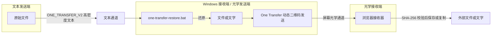
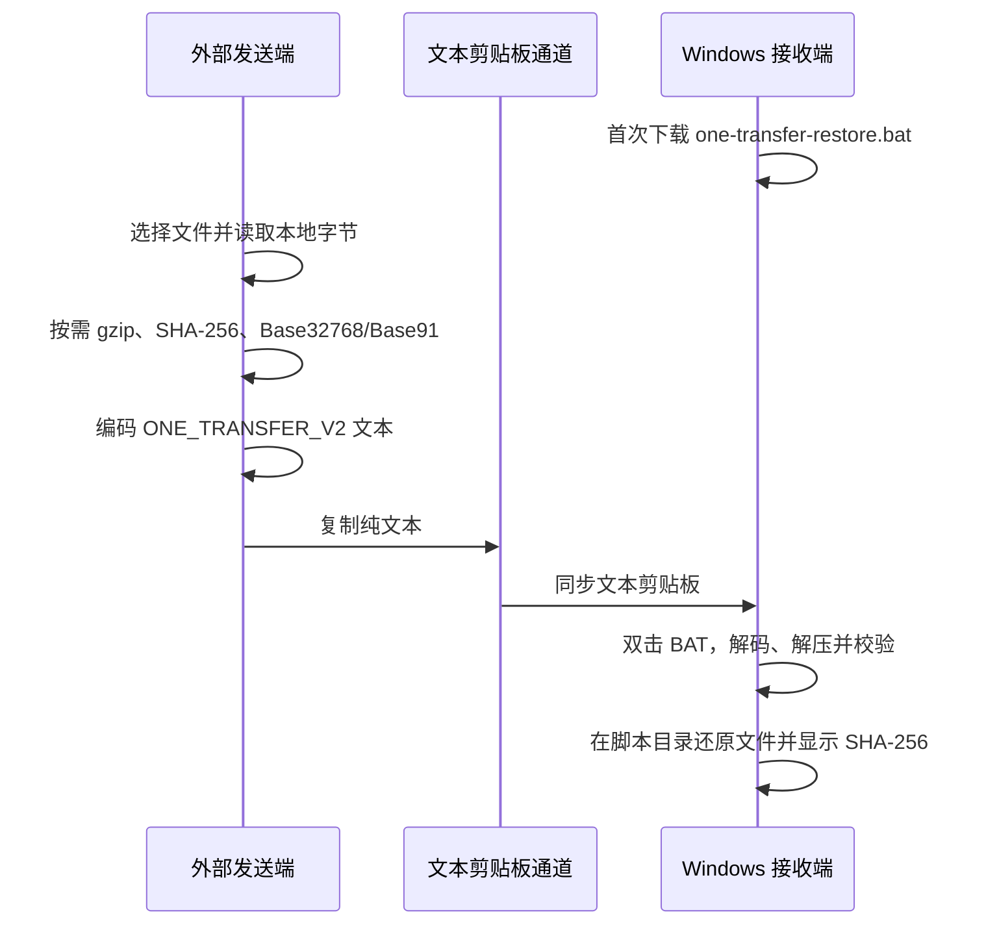
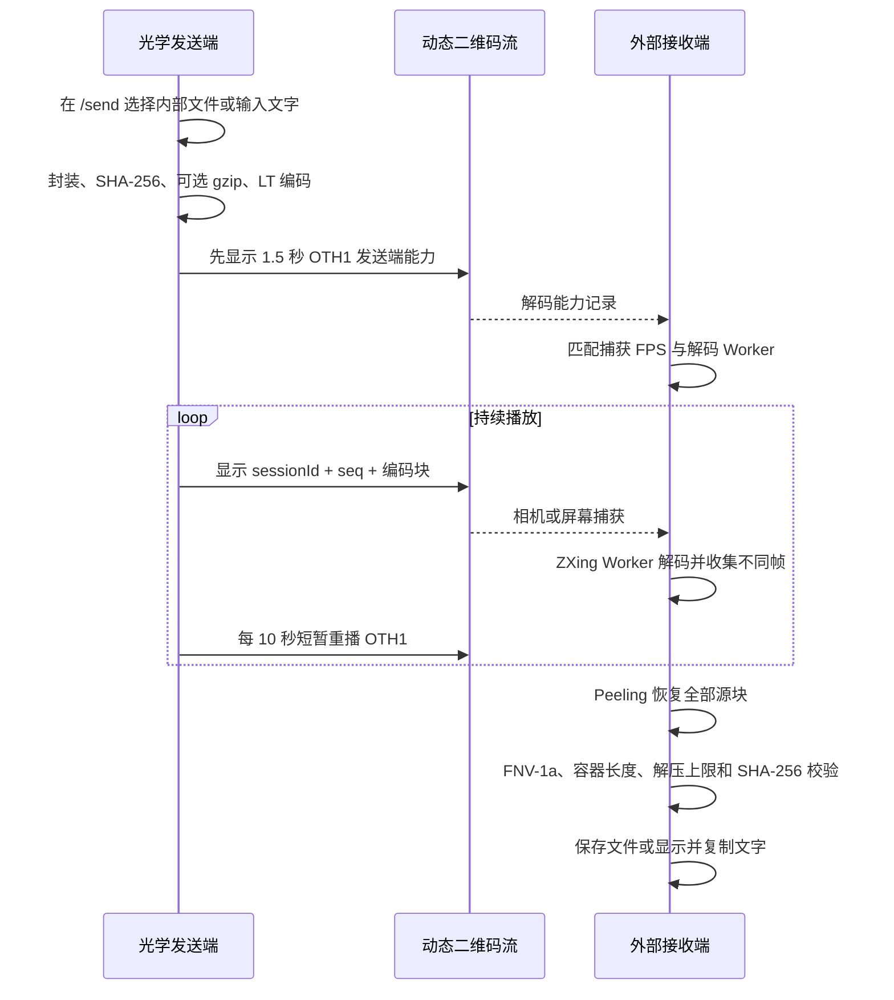

[English](./README.md) | **简体中文**

# One Transfer：双通道数据传输技术方案

> 用光传递数据

<p>
  
  
  
  
  
</p>

仓库：[github.com/zhihui-hu/one-transfer](https://github.com/zhihui-hu/one-transfer)

## ✨ 功能特性

- **光学传输：** 文件和文字通过 LT 喷泉码动态二维码发送，无需发送端与接收端建立连接。
- **文本传文件：** 自动 gzip 后编码为 `ONE_TRANSFER_V2` Base32768/Base91 文本，并在 Windows 端校验恢复。
- **掉帧容错：** 接收任意足量的不重复帧即可恢复，不依赖逐帧重传。
- **完整性校验：** 文件容器、长度、FNV-1a、gzip 上限和 SHA-256 分层校验。
- **浏览器本地处理：** 文件不上传到应用服务器。
- **离线使用：** PWA 缓存 SPA、Worker、WASM 和 Windows 还原脚本。
- **现代界面：** React Router、原生静态 CSS、本地组件与 reduced-motion 友好的 GSAP 动效。

## 🚀 快速开始

```bash
git clone https://github.com/zhihui-hu/one-transfer.git
cd one-transfer
pnpm install
pnpm dev
```

打开 `https://127.0.0.1:5173`。需要手机或局域网设备访问时运行：

```bash
pnpm dev:lan
```

生产构建与完整检查：

```bash
pnpm build
pnpm check
```

### Cloudflare Pages 一键部署

[](https://deploy.workers.cloudflare.com/?url=https://github.com/zhihui-hu/one-transfer)

如果 Cloudflare 没有自动识别，请使用以下设置：

| 配置项 | 值 |
|---|---|
| Framework preset | `Vite` |
| Build command | `pnpm build` |
| Build output directory | `dist` |
| Node.js | `24` 或更高 |

## 使用指南

### 通过纯文本剪贴板传入文件

适用于源端可以复制文字、Windows 接收端可以粘贴文字，但通道不能直接承载文件对象的情况。

1. 在源设备打开 `/clipboard`。
2. 在 Windows 接收端首次下载 `one-transfer-restore.bat`，并把脚本放到希望保存文件的目录。
   如果通道不方便直接下载，页面也会显示完整源码，可以复制并保存为同名 BAT。
3. 默认使用 **ASCII 兼容** Base91，优先适配 Windows、RDP 和可能改写高位 Unicode 的
   受限剪贴板通道；确认通道完整保留 Unicode 时，可切换 **高密度 Unicode** 减少字符数。
4. 选择文件。浏览器只在本地读取文件，计算 SHA-256，对所有内容尝试最高级别 gzip，并显示原始大小、
   gzip 后大小、最终字符数以及相对 V1 Base64 的预计节省比例。
5. 点击 **复制文件数据到剪贴板**，切换到 Windows 会话，等待远程剪贴板完成同步。
6. 双击 `one-transfer-restore.bat`。脚本只有在协议、文件名、解码长度、gzip 上限和 SHA-256
   全部验证通过后，才会把文件写到脚本所在目录。
7. 如果目标文件已经存在，请先移动或改名；脚本不会自动覆盖已有文件。

如果 Windows 提示 Base32768 字符无法识别、填充失败、文本被截断或 SHA-256 不一致，请回到
源页面切换为 **ASCII 兼容**，重新选择同一个文件并复制 Base91 文本。Base91 字符更多，但能
适应会规范化、过滤或重新编码高位 Unicode 的通道。

| 模式 | 适用情况 | 不含协议字段的理论编码开销 |
|---|---|---:|
| 高密度 Unicode / Base32768 | 通道完整保留 Unicode；Windows/RDP 文本路径 | UTF-16 下约 6.67% |
| ASCII 兼容 / Base91 | 只可靠支持可打印 ASCII，或 Unicode 已被修改 | 约 23% |

应用不对剪贴板文件设置大小上限。实际可传输容量由浏览器、远程桌面、网关和安全策略决定。
V2 能发现截断，但不能提高底层通道本身的容量。

### 通过光传输文件或文字

1. 打开 `/send`，选择 **文件** 或 **文字**，然后选择或输入内容。
2. One Transfer 会检查发送电脑，并自动选择当前设备能够承担的最高“稳定/平衡/高速”档位。
   文件上限会随档位同步更新；如果接收画面过小、模糊、被压缩或出现撕裂，请手动降低速度。
3. 保持四个动态二维码完整可见。发送端进度条表示一轮建议喷泉码广播进度，不是接收确认。
4. 在接收设备打开 `/receive`，选择 **扫描电脑屏幕** 或 **使用相机**。
5. 让二维码网格完整进入捕获画面。接收端可以乱序收集不同 symbol，并容忍漏帧和重复帧；
   接收端进度条才表示真实恢复状态。
6. 只有页面完成完整性校验后，才保存文件或复制恢复出的文字。

### Mac 文件与目录辅助脚本

工作区辅助脚本可以生成相同的 V2 文本；选择目录时会先生成 ZIP：

```bash
../deploy/add-transfer.sh /path/to/file-or-directory
```

默认使用 Base32768。需要 ASCII 兼容时运行：

```bash
ONE_TRANSFER_CODEC=base91 ../deploy/add-transfer.sh /path/to/file-or-directory
```

脚本依赖 `python3`、`pbcopy`，传目录时还需要 `zip`。目录归档会保留单一顶层目录，Windows
还原脚本验证结构后再整体移动到目标位置。

### 常见问题

| 现象 | 处理方式 |
|---|---|
| Base32768 字符或填充错误 | 切换 **ASCII 兼容** 后重新复制 |
| SHA-256 或长度校验失败 | 文本被截断或修改，应完整重新复制 |
| 提示目标已存在 | 移动或重命名已有文件；脚本故意不自动覆盖 |
| 网页复制按钮失败 | 允许剪贴板权限，或改用支持 HTTPS 剪贴板写入的浏览器 |
| 二维码接收端长时间无信号 | 降低速度、放大二维码窗口、改善对焦，或直接捕获发送窗口 |
| 二维码进度较慢但仍在变化 | 保持发送画面可见；掉帧只降低速度，不影响最终正确性 |

---

## 摘要

One Transfer 研究两类能力不对称的数据通道。第一类通道只能传递文本，因此系统先按需压缩文件，
默认编码为适合 UTF-16 的 Base32768，并提供 Base91 ASCII 回退，再在 Windows 端恢复；第二类
通道只有可见屏幕而没有可靠回传链路，因此系统把文件或文字封装为带完整性校验的容器，
使用 LT 喷泉码生成连续动态二维码，由另一设备通过屏幕捕获或相机完成光学接收。

系统实现为单入口 Vite SPA，全部文件处理、编码和解码均在浏览器本地完成，应用服务
不接收业务文件。本文给出系统模型、双向传输协议、喷泉码设计、完整工作流、安全边界、
性能模型与工程实现。

**关键词：** 文本通道；Base32768；Base91；动态二维码；LT 喷泉码；单向光学通道；React；Vite

---

## 1. 通道模型与设计目标

### 1.1 通道模型

系统面向以下两类基础通道：

1. **文本通道：** 可以传递 Unicode 文本，但不能直接承载文件对象。
2. **光学通道：** 发送端能够显示画面，接收端能够观察画面，但没有可靠的确认与重传链路。
3. 发送端浏览器能够读取本地文件，接收端能够保存恢复后的字节。

One Transfer 的核心问题不是特定业务环境，而是如何在上述两种通道上定义稳定的数据表示、
掉帧恢复、完整性校验和浏览器端生命周期。

### 1.2 目标

- **文件转文本：** 把文件转换为可复制文本，并恢复原文件名、类型和内容。
- **数据转光：** 把文件或文字转换为无需握手的动态二维码流。
- **本地处理：** 文件内容不上传到 One Transfer 服务端。
- **无握手传输：** 光学接收端可在二维码流中途加入，不要求发送端与接收端建立连接。
- **完整性验证：** 对恢复结果进行长度、容器和摘要校验，不把“解码完成”等同于“文件正确”。
- **部署简单：** 使用单页静态站点，可部署到 Cloudflare Pages、GitHub Pages 或任意静态主机。

### 1.3 应用场景示例

只开放文本剪贴板和可见屏幕、但直接文件交换不方便的环境都可以组合这两条通道，例如远程
桌面、VDI、临时隔离终端、跨设备离线传递或演示设备。应用场景只决定通道是否可用，不参与
协议定义。

### 1.4 非目标

- 本系统不提供端到端加密、身份认证或访问控制。
- 本系统不能在文本剪贴板和屏幕观察均被禁止时建立新通道。
- 本系统不绕过操作系统、终端软件或传输通道本身的容量、审计和内容策略。
- 本系统不是高带宽文件同步工具，不替代经过授权的标准文件交换系统。

---

## 2. 系统模型与总体架构

### 2.1 参与方

| 参与方 | 位置 | 主要职责 |
|---|---|---|
| 文本发送端 | 通道一端 | 选择文件并复制编码后的文本 |
| Windows 文本接收端 / 光学发送端 | 中间端点 | 还原文本负载；选择文件或文字并播放动态二维码 |
| 光学接收端 | 通道另一端 | 扫描二维码，校验并保存文件或复制文字 |

文本发送端与光学接收端可以是同一设备，也可以是不同设备。

### 2.2 双通道架构



两条通道是非对称的：

| 方向 | 业务用途 | 物理通道 | 编码方式 | 接收实现 |
|---|---|---|---|---|
| 文本发送端 → Windows 接收端 | 文件 | 文本剪贴板或其他文本通道 | gzip + Base32768/Base91 + SHA-256 | Windows BAT + PowerShell/C# |
| 光学发送端 → 光学接收端 | 文件 | 屏幕 → 相机/屏幕捕获 | 文件容器 + LT 喷泉码 + QR | 浏览器 + ZXing WASM |
| 光学发送端 → 光学接收端 | 文字 | 屏幕 → 相机/屏幕捕获 | UTF-8 文字容器 + LT 喷泉码 + QR | 浏览器展示并复制 |

普通文字本身可直接通过文本通道，无需再次二进制转文本；剪贴板文件协议主要
解决“通道只允许文本，但业务对象是文件”的问题。

---

## 3. 单页应用设计

### 3.1 技术栈

- React 19、Vite 6 与 TypeScript 5
- React Router 7 持久化 `BrowserRouter` Layout
- 原生静态 CSS 与本地组件
- GSAP 3 加载、路由、Tabs 与页面呼吸动效
- `qrcode` 生成二维码
- `zxing-wasm` 在 Web Worker 中解码二维码
- `base32768` 生成适合 UTF-16 的高密度剪贴板文本，项目内实现 Base91 ASCII 回退
- `vite-plugin-pwa` 生成 Service Worker 和离线缓存
- Web Crypto、Compression Streams、Media Capture、Canvas 与 Clipboard API

### 3.2 路由

整个应用只有一个 HTML 入口：

| 路由 | 功能 |
|---|---|
| `/` | 首页与通道选择 |
| `/send` | 发送文件或文字动态二维码 |
| `/receive` | 在边界外扫描屏幕或使用相机接收 |
| `/clipboard` | 在外部发送端把文件编码成剪贴板文本；在 Windows 端下载还原脚本 |

React Router 的 History 路由使用 `public/_redirects` 配置 Cloudflare Pages SPA 回退。父 Layout 持续存在，每个子路由只挂载
一个页面及其传输控制器；离开发送页会停止二维码动画，离开接收页会在卸载前关闭相机或
屏幕共享、终止解码 Worker 和统计定时器。

HTML 入口只保留一份内联关键启动屏。React 完成挂载并加载传输控制器之前，应用内容保持
隐藏；随后由 GSAP 平滑移除 loading 并显示目标路由。路由切换使用 GSAP Timeline，发送
模式 Tabs 使用 GSAP 滑动指示器，页面背景使用低透明度呼吸动效。系统开启
`prefers-reduced-motion` 时会关闭这些动画。

### 3.3 PWA 与离线能力

生产构建会缓存 SPA、JavaScript、CSS、ZXing WASM、Worker 和
`one-transfer-restore.bat`。首次联网加载完成后，可在无网络条件下继续打开和使用已缓存应用。
严格隔离环境应在进入边界前完成缓存，或部署到组织批准的内部静态站点。

---

## 4. 文件转文本：剪贴板通道方案

### 4.1 发送端处理

外部发送端在 `/clipboard` 选择单个文件后执行以下步骤：

1. 校验文件名是否能在 Windows 使用，包括非法字符、结尾空格/句点和保留设备名。
2. 使用 `File.arrayBuffer()` 在浏览器本地读取文件字节。
3. 计算 SHA-256；对尚未压缩的内容尝试 gzip，只有确实缩小时才采用。
4. 默认使用 Base32768；如果通道会破坏高位 Unicode，则切换 Base91 ASCII 兼容模式。
5. 组成 `ONE_TRANSFER_V2` 并一键写入剪贴板，不在页面渲染文件负载。
6. 如果现代 Clipboard API 不可用，则使用临时文本域与 `execCommand` 兼容复制。

Base32768 每个安全 BMP 字符承载 15 bit，在 UTF-16 通道中效率为 93.75%，理论开销约
6.67%，字符数约为 Base64 的 40%。Base91 只使用可打印 ASCII，开销约 23%，作为会修改
高位 Unicode 的通道回退。页面会显示原始/压缩大小、最终字符数以及相对 V1 Base64 的
预计节省比例。

### 4.2 剪贴板协议

V2 是八字段文本；第八段读取全部剩余内容，因此 Base91 负载中出现 `|` 也不会破坏协议：

```text
ONE_TRANSFER_V2|<itemType>|<codec>|<compression>|<originalSize>|<sha256>|<percentEncodedName>|<payload>
```

| 字段 | 含义 |
|---|---|
| `ONE_TRANSFER_V2` | 协议魔数和版本 |
| `itemType` | `file` 或 `directory` |
| `codec` | `b32768` 或 `base91` |
| `compression` | `none` 或 `gzip` |
| `originalSize` | 解码后精确字节数 |
| `sha256` | 原始字节的小写 SHA-256 |
| 文件名 | 百分号编码的 UTF-8 basename |
| 负载 | 原始字节、gzip 流或目录 ZIP 的文本编码 |

网页当前一次处理一个文件。Mac 发送端如需传目录，可运行
`../deploy/add-transfer.sh <目录路径>`；脚本先生成 ZIP，再输出 V2 Base32768。需要 ASCII 时
设置 `ONE_TRANSFER_CODEC=base91`。Windows 脚本仍能还原升级前生成的 V1 Base64 文本。

### 4.3 Windows 还原流程

Windows 接收端首次使用时，可以从 `/clipboard` 下载 `one-transfer-restore.bat`，也可以复制页面
中显示的完整脚本源码并保存为同名文件，然后放入目标目录。
每次接收时双击该脚本：

1. 检查 Windows PowerShell 是否存在。
2. 使用 `Get-Clipboard -Raw` 读取纯文本剪贴板。
3. 自动识别 V1/V2，并在分配输出前验证全部协议字段。
4. V2 通过内嵌编译的 C# 高速解码 Base32768/Base91；V1 保留 Base64 兼容解码。
5. gzip 解压以协议原始大小为硬上限。
6. 写盘前验证精确长度与 SHA-256。
7. 拒绝覆盖脚本目录中的同名目标。
8. 文件直接写入；目录 ZIP 在随机临时目录解压后整体移动。
9. 输出 SHA-256，清理临时数据并停留显示结果。

还原脚本不执行来自剪贴板的命令，也不会把文件名拼入 PowerShell 命令文本；文件名仅作为
经过校验的路径参数使用。

### 4.4 传入操作时序



### 4.5 压缩流水线与体积优化

剪贴板发送端按以下顺序处理数据：

```text
原始字节
  ├─ SHA-256(原始字节)
  └─ 可选 gzip
       └─ Base32768 或 Base91
            └─ ONE_TRANSFER_V2 头 + 编码负载
```

网页发送端对所有文件和文件夹 ZIP 都尝试最高级别 gzip。为保证最终传输内容尽可能小，
只在 gzip 结果小于原始字节时采用：

```text
gzipSize < originalSize
```

已压缩的视频、ZIP、图片、音频和 Office 文件也会实际尝试；如果 gzip 反而更大，则自动保留较小的原始数据。

设原始字节数为 `N`，可选 gzip 后实际传输字节数为 `C`，V2 协议头和编码文件名字符数为
`H`，则最终文本长度可近似表示为：

```text
Base32768 字符数 ≈ ceil(8 × C / 15) + H
Base91 字符数    ≈ 1.23 × C + H
旧版 Base64      ≈ 4 × ceil(N / 3) + legacyHeader
```

Base32768 在字符数量和 UTF-16 存储中更小。如果中间服务把文本转换成 UTF-8，并按照 UTF-8
字节数限制，BMP 字符通常占三个 UTF-8 字节；此时 Base91 虽然可见字符更多，实际线路字节数
却可能更小。应以真实通道的限制方式和实测结果为准，不能只看浏览器显示的字符数。

减小传输文本体积时建议：

1. 除非通道会修改 Unicode 或明确只允许 ASCII，否则优先使用 **高密度 Unicode**。
2. 文件交给 One Transfer 即可；页面会统一尝试最高级别 gzip，并自动选择体积更小的表示。
3. JPEG、PNG、WebP、MP4、ZIP、7z、RAR、Office 等已压缩文件也会参与试压，无需手动预处理。
4. 创建目录归档前先删除缓存、构建产物、无用调试日志等不需要传递的内容。压缩无法替代
   对无用数据的清理。
5. 目录直接使用页面的“完整文件夹”或“前端 / Python 工程”入口，页面会以最高级别生成单一 ZIP。
6. 如果具体剪贴板上限小于最终 V2 字符数，请先把源文件拆成较小文件再分别编码。V2 当前
   一次还原一条完整记录，不维护多段传输状态。

还原过程严格反向执行：文本解码 → 有上限的 gzip 解压 → 精确长度校验 → SHA-256 校验 →
写盘。脚本不单独信任 gzip 尾部或协议声明大小，任何一步失败都不会生成目标文件。

---

## 5. 数据转光：光学喷泉码方案

### 5.1 文件与文字统一容器

文件和文字使用相同的光学容器。文字先编码为 UTF-8，并使用兼容媒体类型
`application/vnd.decimen.snippet` 标识；接收端据此决定显示“复制文字”还是“保存文件”。

文件容器采用小端序，固定头长度为 49 字节：

| 偏移 | 长度 | 字段 | 说明 |
|---:|---:|---|---|
| 0 | 4 | Magic | ASCII `DCF2` |
| 4 | 1 | Compression | `0` 无压缩，`1` gzip |
| 5 | 2 | Name Length | UTF-8 文件名字节数 |
| 7 | 2 | Type Length | MIME 类型字节数 |
| 9 | 4 | Original Length | 原始文件长度 |
| 13 | 4 | Transmitted Length | 实际光学负载长度 |
| 17 | 32 | SHA-256 | 原始文件摘要 |
| 49 | 可变 | Name + Type + Payload | 文件名、MIME 和文件内容 |

光学文件上限从当前档位的每码字节数、20 字节帧头和 `u16` 源块数动态计算：
稳定约 90.2 MiB、平衡约 104.9 MiB、高速约 144.3 MiB。文字上限仍为 4 MiB，剪贴板文件不设应用级大小上限。
发送端对可压缩内容尝试 gzip；JPEG、视频、ZIP、Office Open XML 等已经压缩的格式
直接跳过，以避免额外内存和 CPU 开销。只有压缩结果至少节省 64 字节时才采用 gzip。

接收端解压时不信任 gzip 尾部声明，而是流式累计输出并使用原始长度作为硬上限，避免小型
压缩包异常膨胀。

### 5.2 LT 喷泉码

光学链路没有可靠回传通道，接收端无法要求重传丢失的二维码帧。One Transfer 使用
LT（Luby Transform）喷泉码解决该问题：

1. 将容器切分为 `K` 个等长源块，最后一块补零。
2. 每个序号 `seq` 通过确定性伪随机函数选取一个度数 `d`。
3. 按鲁棒孤子分布选择 `d` 个不同源块。
4. 对这些块逐字执行 XOR，得到一个编码块。
5. 发送端持续生成新序号，因此可以无限播放不重复的编码帧。
6. 接收端收集任意足量的不同帧，通过 peeling 过程逐步消元并恢复全部源块。

鲁棒孤子分布参数为 `c = 0.1`、`δ = 0.5`。发送端和接收端必须对同一
`sessionId + seq` 得到完全相同的度数和块索引。由于不同 JavaScript 引擎的
`Math.log` 可能存在 1 ULP 差异，代码使用只依赖明确 IEEE-754 运算的确定性对数实现，
并通过黄金向量测试固定其线协议行为。

喷泉码使丢帧变成吞吐损失而不是正确性失败：发送端无需知道哪些帧被接收，接收端也可以
在播放中途加入。

### 5.3 二维码帧协议

每个二维码携带 20 字节固定头和一个编码块，全部为小端序：

| 偏移 | 类型 | 字段 | 说明 |
|---:|---|---|---|
| 0 | `u8` | Magic 0 | `0xD1` |
| 1 | `u8` | Magic 1 | `0x0C` |
| 2 | `u16` | Session ID | 每次开始发送随机生成 |
| 4 | `u32` | Sequence | 喷泉码伪随机选择的输入 |
| 8 | `u16` | K | 源块数量 |
| 10 | `u16` | Block Length | 每帧编码块长度 |
| 12 | `u32` | Total Length | 完整容器长度 |
| 16 | `u32` | Payload FNV-1a | 容器快速完整性检查 |
| 20 | 可变 | Encoded Block | XOR 后的喷泉码数据块 |

默认高吞吐布局持续显示 4 个可独立解码的二维码，每次画面更新同时替换四格。
平衡参数每秒产生 `4 × 30 = 120` 个 symbol、每码 1700 字节；扣除 20 字节帧头后，
每码携带 1680 字节编码块。数据帧 QR 纠错级别为 L。页面使用“每码字节、刷新 FPS、
每次更新码数”三个数字控制，设备检测会自动应用稳定、平衡或高速初值，手动修改则需确认。

每个数据流开始前，发送端会先把 20 字节 `OTH1` 能力记录编码为 ECC M 二维码，
在四格中重复显示 1.5 秒，然后才开始 LT 数据帧。为了让后启动的接收端仍能完成匹配，
发送过程中每 10 秒会用一个码位重播约 500 ms，不更改当前数据会话。

| 偏移 | 类型 | 能力字段 | 说明 |
|---:|---|---|---|
| 0 | `4 × u8` | Magic | ASCII `OTH1` |
| 4 | `u8` | Version | 当前为 1 |
| 5 | `u8` | Logical cores | 发送端逻辑线程数 |
| 6 | `u8` | Device memory | GiB，0 表示浏览器未提供 |
| 7 | `u8` | Refresh rate | 测得 Hz，0 表示未知 |
| 8–11 | `4 × u8` | 发送状态 | 每次码数、目标 FPS、DPR×10、输出达成率 |
| 12 | `u16` | Short viewport edge | 发送窗口短边 CSS 像素 |
| 14 | `u16` | Frame bytes | 当前每码总字节数 |
| 16 | `u16` | Session ID | 与后续 LT 帧相同 |
| 18 | `u16` | Checksum | 前 18 字节的加和校验 |

进入发送页后，One Transfer 会先检查浏览器允许读取的本机能力：逻辑 CPU 数、近似内存、
通过动画帧测得的刷新率，以及当前窗口短边尺寸。只有完整满足条件时才选择更高档位：

| 档位 | 本机推荐边界 | 原始吞吐模型 |
|---|---|---:|
| 稳定 | CPU、刷新率或物理像素不足 | 约 135 KiB/s |
| 平衡 | 6+ 逻辑线程、约 4+ GiB、45+ Hz、物理短边 1200px+ | 约 197 KiB/s |
| 高速 | 8+ 逻辑线程、约 8+ GiB、55+ Hz、物理短边 1800px+ | 约 271 KiB/s |

部分浏览器会因隐私策略隐藏 `deviceMemory`，未知值不会单独触发降档。页面会显示
检测结果、推荐数字和选择原因。用户一旦开始手动编辑，延迟返回的设备检测不会覆盖这些输入。

接收端解码 `OTH1` 后，结合发送 symbol 速率和自身逻辑线程数，先选择 30/45/60 之一的
捕获 FPS 和 2–4 个解码 Worker。接收开始后每 8 秒结合平均解码耗时、忙碌丢帧、
唯一帧率、重复率和净带宽小步调整自身 FPS/Worker；用户手动选过的字段不再被自动覆盖。

### 5.4 二维码生成与接收

发送端使用 Canvas 绘制二维码，固定掩码以减少逐帧生成成本，并保持屏幕唤醒。接收端提供：

- `getDisplayMedia`：接收端直接捕获包含动态二维码的窗口或屏幕。
- `getUserMedia`：手机或其他设备使用相机扫描发送端屏幕。
- 预览容器使用视频轨道的实际宽高比，纵向相机不会被塞进横向画框产生黑边。
- Canvas 降采样：4K 屏幕帧先缩放到配置宽度，避免把无效像素送入解码器。
- Worker 池：普通帧对完整中心画面快速搜索最多 4 个 symbol；连续失败时才启用旋转、反色、
  缩放与降噪的 Robust 回退。
- Fast/Robust 双路径：普通帧关闭 `tryHarder`、旋转、反色、缩放和降噪搜索；连续快速
  识别失败后才稀疏触发一次 Robust 回退，避免每帧支付完整搜索成本。
- Worker 全忙时直接丢帧，喷泉码负责容错。
- 代际计数器：停止并重启媒体流时使旧回调失效，防止僵尸捕获循环。

恢复完成后先校验帧级 FNV-1a，再解析容器、按需解压并校验 SHA-256。只有全部检查通过，
接收端才提供下载链接或文字复制按钮。

### 5.5 传出操作时序



---

## 6. 文字传输

### 6.1 文字通过文本通道传递

该方向已经存在纯文本剪贴板通道，因此直接复制粘贴即可。把普通文字再次封装为文件不会
增加能力，只会增加二进制转文本开销。

### 6.2 文字通过光学通道传递

在发送端打开 `/send` 并切换到“文字”，输入或粘贴内容后开始发送。文字按 UTF-8
封装进与文件相同的容器和喷泉码流，最大 4 MiB。外部接收端识别专用 MIME 类型后直接
显示原文，并提供复制按钮；页面关闭后不持久化文字内容。

---

## 7. 完整性、可靠性与安全边界

### 7.1 完整性层次

| 层次 | 机制 | 作用 |
|---|---|---|
| 二维码 | QR 纠错 | 识别单帧中的局部视觉错误 |
| 光学流 | LT 喷泉码 | 容忍帧丢失、重复和乱序 |
| 帧集合 | FNV-1a | 快速检查恢复出的容器是否一致 |
| 文件 | SHA-256 | 最终验证原始文件内容 |
| 剪贴板还原 | 协议长度 + SHA-256 | 写盘前拒绝截断或篡改 |

FNV-1a 仅用于快速误码检测，不应视为抗攻击认证。SHA-256 保证内容摘要一致，
但由于摘要与数据来自同一未认证通道，也不等价于发送方身份认证。

### 7.2 防护措施

- 文件名在发送端和接收端均收敛为 basename，拒绝路径分隔符、控制字符和 Windows 保留名。
- Windows 脚本拒绝覆盖同名文件。
- 目录恢复使用随机临时目录，并在成功或失败后清理。
- gzip 解压设置硬输出上限，避免异常压缩数据消耗无限内存。
- 接收端忽略已完成的同一光学流，直到出现新的会话标识。
- 离开 SPA 接收路由会主动停止相机、屏幕共享、Worker 和定时器。
- 加载状态使用支持 `prefers-reduced-motion` 降级的文字扫光效果。

### 7.3 明确风险

- **无保密性：** 剪贴板编码文本和屏幕二维码都包含原始数据。
- **无认证：** 任何能写入剪贴板或把二维码放进扫描画面的人都能提供输入。
- **可审计性：** 运行环境、终端软件或操作系统可能记录剪贴板内容和屏幕行为。
- **肩窥风险：** 光学发送期间，任何能看到屏幕的相机都可能接收数据。
- **容量风险：** 大型文本仍可能被通道截断；V2 会拒绝损坏结果，但不能提高通道上限。

敏感数据需要额外加密时，应先在发送端使用组织批准的加密工具生成密文文件，再使用
One Transfer 传递密文。

---

## 8. 性能模型

### 8.1 文本剪贴板通道

对未压缩字节，Base32768 在 UTF-16 通道中的理论开销约为 6.67%，每个输入字节约产生
0.533 个字符；Base91 开销约 23%，但完全由可打印 ASCII 组成。如果中间服务按 UTF-8
字节收费而不是按字符或 UTF-16 code unit 限制，Base32768 可能反而更大，因此 V2 同时提供
两种模式。文本、JSON、源码和日志通常先被 gzip 大幅缩小，压缩收益会超过编码差异。
发送与接收端仍需同时容纳原始、传输和解码数据，因此实际上限低于浏览器理论内存上限。

### 8.2 光学通道

发送端持续显示 4 个二维码，但每次画面更新只替换 1 个。这样每个码保持 4 个更新周期，
屏幕刷新与相机滚动快门重叠时不会同时破坏四格。理论吞吐模型为：

```text
symbolsPerSecond = symbolsPerTick × ticksPerSecond
rawKiB/s = symbolsPerSecond × (frameBytes - headerBytes) / 1024
netKiB/s ≈ rawKiB/s × decodeSuccessRate / fountainOverhead
```

平衡档参数为 `4 × 30 = 120` symbols/s，`blockLength = 1700 - 20 = 1680` 字节，对应
`196.875 KiB/s` 的原始载荷理论上限。这是模型而非实测结果。接收端设置弹窗中的
可复制日志会记录捕获、Worker、识别、重复帧、喷泉解码和净带宽数据。例如：

| 不重复 symbol 解码率 | 喷泉码开销 | 估算净吞吐 |
|---:|---:|---:|
| 100% | 1.15× | 171.2 KiB/s |
| 75% | 1.20× | 123.0 KiB/s |
| 50% | 1.30× | 75.7 KiB/s |

真实吞吐受屏幕刷新率、二维码跨刷新撕裂、相机曝光、自动对焦、距离、环境光、
屏幕摩尔纹、视频压缩、WASM 解码能力和喷泉码冗余共同影响。Fast 路径避免每帧执行困难图像
搜索，只在连续失败后稀疏执行 Robust 回退。提高单码密度并不总能提高最终吞吐；当
识别率下降时，降低密度和画面更新率反而可能更快。

光学链路是单向通道，因此能力前导帧只能让接收端自动调整自身，不能把实测结果回传并
远程改写发送参数。当远程桌面或采集流达不到目标帧率时，接收端会看到缺失或重复的
symbol：传输会变慢，但 LT 恢复与最终校验会阻止损坏内容被接受。接收端会显示基于实测链路的
发送端建议数字，由操作者在发送页确认应用；图像质量长期不稳定时，可使用
`1465 字节 / 60 FPS / 每次 1 码`的稳定参数作为回退起点。

当前线协议仍使用现有 LT 喷泉码。RaptorQ 可作为后续方向，以获得更低、更稳定的恢复开销，
但它需要引入版本化协议变更，不属于本次 4 二维码高吞吐更新。

发送端进度条表示“一轮建议广播”的完成比例：已播放 symbol 数除以根据 `K` 和喷泉码预期开销
算出的目标数。由于发送端没有回传，进度到达一轮末尾后会继续下一轮，不能代表接收完成。
接收端进度条才是真实恢复进度；它综合不同帧数量、理论喷泉码开销和已解块数量，完成校验前
最多显示 99%。

---

## 9. 工程结构

```text
one-transfer/
├── index.html                 # 最小 Vite 入口与关键启动屏
├── src/
│   ├── main.tsx               # React 根节点与 BrowserRouter
│   ├── app.tsx                # 应用入口导出
│   ├── app/                   # React Router 路由表、持久 Layout 与路由私有代码
│   │   ├── components/        # 发送与接收共用组件
│   │   ├── home/              # 首页路由
│   │   ├── send/              # 发送页、二维码及剪贴板控制器
│   │   └── receive/           # 接收页、控制器与 ZXing Worker
│   ├── styles.css             # Chrome 109 兼容的静态 CSS 与控制器样式
│   ├── components/            # 构建信息、更新检查与本地组件
│   ├── hooks/                 # 跨路由控制器生命周期
│   ├── lib/device-capabilities.ts # 浏览器设备能力检测
│   └── lib/utils.ts           # class 合并工具
├── shared/                    # 协议、喷泉码、校验、格式化与通用逻辑
│   ├── clipboard-processing.worker.ts # 目录 ZIP、gzip、SHA-256 与 Base91
│   └── clipboard-processing-client.ts # 剪贴板 Worker 生命周期与取消
├── public/                    # Windows 还原脚本与更新检查 Worker
├── .github/workflows/         # GitHub Pages 与 Cloudflare Pages 自动部署
├── tests/                     # 协议黄金向量和单元测试
└── vite.config.ts             # SPA、HTTPS 开发环境和 PWA
```

`../deploy/add-transfer.sh` 是工作区级 Mac 辅助脚本，不属于 Web SPA 构建产物；它与网页
共享 `ONE_TRANSFER_V2` Base32768/Base91 协议。

---

## 10. 开发、构建与部署

### 10.1 环境要求

- Node.js 24 或更高版本
- pnpm 10
- 现代浏览器；剪贴板压缩需要 Web Worker，接收端还需要 WebAssembly 和 Media Capture
- Windows 接收端需要 Windows PowerShell 与 `Get-Clipboard`

### 10.2 常用命令

```bash
pnpm install
pnpm dev       # 仅本机访问，终端只显示一个地址
pnpm dev:lan   # 监听全部网卡，供手机或局域网设备访问
pnpm test      # 协议、喷泉码、进度和剪贴板单元测试
pnpm build     # TypeScript 检查并构建 SPA/PWA 到 dist/
pnpm preview   # 预览生产构建
pnpm preview:lan # 在局域网预览生产构建
pnpm check     # 依次执行测试和生产构建
```

把 `dist/` 单独复制到云电脑后，无需安装依赖，直接在该目录启动：

```bash
cd dist
node serve.mjs       # http://127.0.0.1:8080
node serve.mjs 9000  # 可选：指定端口
```

`serve.mjs` 会处理 `/send` 和 `/receive` 的 SPA 直达与刷新回退。默认仅监听本机；
需要局域网访问时可设置 `ONE_TRANSFER_HOST=0.0.0.0`。

接收页面依赖 `getUserMedia` 和 `getDisplayMedia`。局域网设备访问开发服务器时必须使用
HTTPS；开发证书为自签名证书，首次访问需要由测试人员明确接受。

`pnpm dev` 默认绑定 `127.0.0.1`，因此只输出一个本机地址。只有需要手机或其他设备访问时
才运行 `pnpm dev:lan`；此时 Vite 会列出 Wi-Fi、VPN、虚拟机和隧道等所有活动网卡地址。
这些地址指向同一个开发服务器，并不代表启动了多个进程。

### 10.3 Cloudflare Pages

`.github/workflows/pages.yml` 会在推送到 `main` 或手动触发时只执行一次测试和构建，
再用同一份 `dist` artifact 分别部署 GitHub Pages 和 Cloudflare Pages。Cloudflare 任务会先检查
`one-transfer` Pages 项目，不存在时自动创建。
仓库需要配置：

- `CLOUDFLARE_API_TOKEN`：授予目标账户 **Cloudflare Pages: Edit** 权限；
- `CLOUDFLARE_ACCOUNT_ID`：Cloudflare 账户 ID。

本地直接部署：

```bash
pnpm check
pnpm exec wrangler pages deploy dist --project-name=one-transfer --branch=main
```

### 10.4 GitHub Actions 自动部署

工作流使用 Node.js 24 和 `package.json` 声明的 pnpm 版本，不会把 Cloudflare 凭据写入仓库。
两个部署 job 相互独立；Cloudflare 部署失败不会阻断 GitHub Pages 部署。

### 10.5 构建版本与更新检查

Vite 会把 `package.json` 版本、构建时间和 Git commit 写入应用，同时生成
`dist/version.json`。`BuildInfo` 在开发者控制台输出完整信息，页脚显示版本号和短 commit。
同源 Worker 会在启动、页面重新可见以及每五分钟检查一次 `version.json`；版本或 commit
变化时显示更新提示。PWA Service Worker 继续负责缓存替换和新控制器激活。

---

## 11. 测试与验证策略

自动化测试覆盖以下线协议与关键算法：

- 剪贴板协议字段、Unicode 文件名、空文件和 Windows 文件名规则。
- 光学文件容器、gzip 决策、SHA-256、畸形数据与解压长度限制。
- 二维码 20 字节帧头的黄金向量。
- 确定性对数、鲁棒孤子分布、块索引与跨会话差异。
- LT 编解码、乱序、重复帧和 30% 随机丢帧恢复。
- 帧容量上限、显示尺寸、进度估算、无信号提示与 Worker 池生命周期。
- 受限、普通与高性能发送设备的自动档位推荐。
- 四码吞吐模型、Worker 批量解码结果与性能计数器。
- 文件与 UTF-8 文字的完整往返。

生产构建还应确认：

1. `dist/` 只包含一个 `index.html`。
2. `dist/version.json` 与 JavaScript 构建中写入的版本一致。
3. Service Worker 预缓存 SPA、Workers、WASM 和 Windows 还原脚本。
4. `public/one-transfer-restore.bat` 与工作区部署脚本保持一致。
5. 在真实 Windows 接收端完成一次文本还原，并通过相机或屏幕捕获完成一次光学传输。

前四项可以在开发机自动验证；第五项属于真实运行环境边界，不能由静态构建替代。

---

## 12. 局限与后续方向

- 为剪贴板协议增加分块、序号和分段校验，适配有单次文本长度限制的通道。
- 为两条通道增加可选的组织批准加密层和发送方认证。
- 在 Windows 端提供签名的 PowerShell/可执行接收器，减少批处理对环境编码的依赖。
- 在更多真实设备上校准现有自动参数；存在返回通道时再增加发送端闭环反馈。
- 建立不同文本通道、浏览器、摄像头和屏幕组合的吞吐基准矩阵。
- 增加浏览器端目录打包，使目录传入不再依赖 Mac 辅助脚本。

---

## 13. 结论

One Transfer 为两类能力不同的通道定义了一套完整数据流：文件以 gzip/Base32768 或 Base91 V2 文本通过文本
通道传递，文件和文字也可以使用 LT 喷泉码动态二维码经光学链路传递。文本协议解决
“通道只能承载文字”的问题，喷泉码解决“屏幕到相机无回传、会丢帧”的问题；React SPA
则统一了发送、接收、加载与生命周期管理。

系统保证的是本地处理、掉帧容错和内容完整性，不提供保密性与身份认证。只有在组织明确
允许相应文本剪贴板和屏幕观察通道的前提下，才能将其用于实际数据交换。

---

## 参考文献

1. M. Luby, “LT Codes,” *Proceedings of the 43rd Annual IEEE Symposium on Foundations of Computer Science*, 2002.
2. ISO/IEC 18004, *Information technology — Automatic identification and data capture techniques — QR Code bar code symbology specification*.
3. NIST FIPS PUB 180-4, *Secure Hash Standard (SHS)*.
4. P. Deutsch, RFC 1952, *GZIP File Format Specification version 4.3*, 1996.
5. W3C, *Media Capture and Streams* and *Screen Capture* specifications.
6. `zxing-wasm`，[Reader API 与解码选项](https://github.com/Sec-ant/zxing-wasm#reader-api)。
7. `zxing-cpp`，[WebAssembly 性能说明](https://github.com/zxing-cpp/zxing-cpp/tree/master/wrappers/wasm)。
8. `RaptorQR`，[多二维码光传输实现与基准](https://github.com/infrost/RaptorQR)。
9. `base32768`，[面向 UTF-16 的高密度二进制转文本编码](https://github.com/qntm/base32768)。
10. M. Botta 等，[《A Survey of Printable Encodings》，Algorithms 18(8)，2025](https://doi.org/10.3390/a18080504)。

## License

本项目使用 [MIT License](./LICENSE)。欢迎提交
[Issue](https://github.com/zhihui-hu/one-transfer/issues) 和 Pull Request。

光学协议与喷泉码实现基于 BashAlarmist 的 Decimen Optical Transfer 演进；原始版权归属与
当前项目贡献说明见 [LICENSE](./LICENSE) 和 [NOTICE](./NOTICE)。
