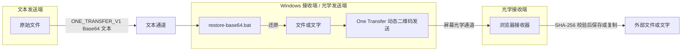
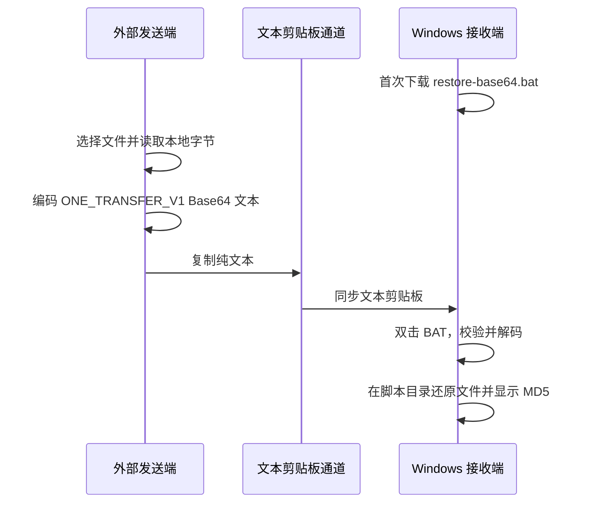
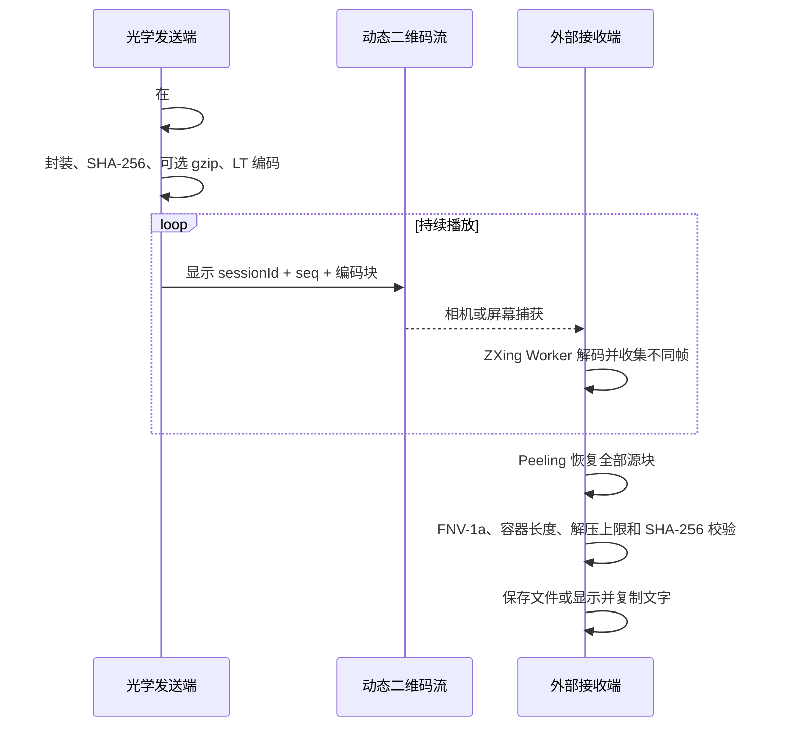

[English](./README.md) | **简体中文**

# One Transfer：双通道数据传输技术方案

> 用光传递数据

<p>
  
  
  
  
  
  
  
</p>

仓库：[github.com/zhihui-hu/one-transfer](https://github.com/zhihui-hu/one-transfer)

## ✨ 功能特性

- **光学传输：** 文件和文字通过 LT 喷泉码动态二维码发送，无需发送端与接收端建立连接。
- **文本传文件：** 将文件编码为 `ONE_TRANSFER_V1` Base64 文本，并在 Windows 端恢复。
- **掉帧容错：** 接收任意足量的不重复帧即可恢复，不依赖逐帧重传。
- **完整性校验：** 文件容器、长度、FNV-1a、gzip 上限和 SHA-256 分层校验。
- **浏览器本地处理：** 文件不上传到应用服务器。
- **离线使用：** PWA 缓存 SPA、Worker、WASM 和 Windows 还原脚本。
- **现代界面：** React Router、Tailwind CSS、shadcn/ui 与 reduced-motion 友好的 GSAP 动效。

## 🚀 快速开始

```bash
git clone https://github.com/zhihui-hu/one-transfer.git
cd one-transfer
pnpm install
pnpm dev
```

打开 `https://127.0.0.1:5173`。需要手机或局域网设备访问时运行：

```bash
pnpm dev:lan
```

生产构建与完整检查：

```bash
pnpm build
pnpm check
```

### Cloudflare Pages 一键部署

[](https://deploy.workers.cloudflare.com/?url=https://github.com/zhihui-hu/one-transfer)

如果 Cloudflare 没有自动识别，请使用以下设置：

| 配置项 | 值 |
|---|---|
| Framework preset | `Vite` |
| Build command | `pnpm build` |
| Build output directory | `dist` |
| Node.js | `24` 或更高 |

---

## 摘要

One Transfer 研究两类能力不对称的数据通道。第一类通道只能传递文本，因此系统把文件、
UTF-8 文件名和类型信息编码为版本化 Base64 文本，再在 Windows 端恢复原始数据；第二类
通道只有可见屏幕而没有可靠回传链路，因此系统把文件或文字封装为带完整性校验的容器，
使用 LT 喷泉码生成连续动态二维码，由另一设备通过屏幕捕获或相机完成光学接收。

系统实现为单入口 Vite SPA，全部文件处理、编码和解码均在浏览器本地完成，应用服务
不接收业务文件。本文给出系统模型、双向传输协议、喷泉码设计、完整工作流、安全边界、
性能模型与工程实现。

**关键词：** 文本通道；Base64；动态二维码；LT 喷泉码；单向光学通道；React；Vite

---

## 1. 通道模型与设计目标

### 1.1 通道模型

系统面向以下两类基础通道：

1. **文本通道：** 可以传递 Unicode 文本，但不能直接承载文件对象。
2. **光学通道：** 发送端能够显示画面，接收端能够观察画面，但没有可靠的确认与重传链路。
3. 发送端浏览器能够读取本地文件，接收端能够保存恢复后的字节。

One Transfer 的核心问题不是特定业务环境，而是如何在上述两种通道上定义稳定的数据表示、
掉帧恢复、完整性校验和浏览器端生命周期。

### 1.2 目标

- **文件转文本：** 把文件转换为可复制文本，并恢复原文件名、类型和内容。
- **数据转光：** 把文件或文字转换为无需握手的动态二维码流。
- **本地处理：** 文件内容不上传到 One Transfer 服务端。
- **无握手传输：** 光学接收端可在二维码流中途加入，不要求发送端与接收端建立连接。
- **完整性验证：** 对恢复结果进行长度、容器和摘要校验，不把“解码完成”等同于“文件正确”。
- **部署简单：** 使用单页静态站点，可部署到 Cloudflare Pages、GitHub Pages 或任意静态主机。

### 1.3 应用场景示例

只开放文本剪贴板和可见屏幕、但直接文件交换不方便的环境都可以组合这两条通道，例如远程
桌面、VDI、临时隔离终端、跨设备离线传递或演示设备。应用场景只决定通道是否可用，不参与
协议定义。

### 1.4 非目标

- 本系统不提供端到端加密、身份认证或访问控制。
- 本系统不能在文本剪贴板和屏幕观察均被禁止时建立新通道。
- 本系统不绕过操作系统、终端软件或传输通道本身的容量、审计和内容策略。
- 本系统不是高带宽文件同步工具，不替代经过授权的标准文件交换系统。

---

## 2. 系统模型与总体架构

### 2.1 参与方

| 参与方 | 位置 | 主要职责 |
|---|---|---|
| 文本发送端 | 通道一端 | 选择文件并复制编码后的文本 |
| Windows 文本接收端 / 光学发送端 | 中间端点 | 还原文本负载；选择文件或文字并播放动态二维码 |
| 光学接收端 | 通道另一端 | 扫描二维码，校验并保存文件或复制文字 |

文本发送端与光学接收端可以是同一设备，也可以是不同设备。

### 2.2 双通道架构



两条通道是非对称的：

| 方向 | 业务用途 | 物理通道 | 编码方式 | 接收实现 |
|---|---|---|---|---|
| 文本发送端 → Windows 接收端 | 文件 | 文本剪贴板或其他文本通道 | Base64 文本协议 | Windows BAT + PowerShell |
| 光学发送端 → 光学接收端 | 文件 | 屏幕 → 相机/屏幕捕获 | 文件容器 + LT 喷泉码 + QR | 浏览器 + ZXing WASM |
| 光学发送端 → 光学接收端 | 文字 | 屏幕 → 相机/屏幕捕获 | UTF-8 文字容器 + LT 喷泉码 + QR | 浏览器展示并复制 |

普通文字本身可直接通过文本通道，无需再次 Base64 编码；剪贴板文件协议主要
解决“通道只允许文本，但业务对象是文件”的问题。

---

## 3. 单页应用设计

### 3.1 技术栈

- React 19、Vite 6 与 TypeScript 5
- React Router 7 持久化 `HashRouter` Layout
- Tailwind CSS 4 与本地 shadcn/ui 组件
- GSAP 3 加载、路由、Tabs 与页面呼吸动效
- `qrcode` 生成二维码
- `zxing-wasm` 在 Web Worker 中解码二维码
- `vite-plugin-pwa` 生成 Service Worker 和离线缓存
- Web Crypto、Compression Streams、Media Capture、Canvas 与 Clipboard API

### 3.2 路由

整个应用只有一个 HTML 入口：

| 路由 | 功能 |
|---|---|
| `#/` | 首页与通道选择 |
| `#/send` | 发送文件或文字动态二维码 |
| `#/receive` | 在边界外扫描屏幕或使用相机接收 |
| `#/clipboard` | 在外部发送端把文件编码成剪贴板文本；在 Windows 端下载还原脚本 |

React Router 的 Hash 路由不依赖服务器重写规则。父 Layout 持续存在，每个子路由只挂载
一个页面及其传输控制器；离开发送页会停止二维码动画，离开接收页会在卸载前关闭相机或
屏幕共享、终止解码 Worker 和统计定时器。

HTML 入口只保留一份内联关键启动屏。React 完成挂载并加载传输控制器之前，应用内容保持
隐藏；随后由 GSAP 平滑移除 loading 并显示目标路由。路由切换使用 GSAP Timeline，发送
模式 Tabs 使用 GSAP 滑动指示器，页面背景使用低透明度呼吸动效。系统开启
`prefers-reduced-motion` 时会关闭这些动画。

### 3.3 PWA 与离线能力

生产构建会缓存 SPA、JavaScript、CSS、ZXing WASM、Worker 和
`restore-base64.bat`。首次联网加载完成后，可在无网络条件下继续打开和使用已缓存应用。
严格隔离环境应在进入边界前完成缓存，或部署到组织批准的内部静态站点。

---

## 4. 文件转文本：剪贴板通道方案

### 4.1 发送端处理

外部发送端在 `#/clipboard` 选择单个文件后执行以下步骤：

1. 校验文件名是否能在 Windows 使用，包括非法字符、结尾空格/句点和保留设备名。
2. 使用 `File.arrayBuffer()` 在浏览器本地读取文件字节。
3. 将 UTF-8 文件名和文件内容分别编码为 Base64。
4. 组成 `ONE_TRANSFER_V1` 文本并调用 Clipboard API 写入剪贴板。
5. 如果现代 Clipboard API 不可用，则使用隐藏文本域执行兼容复制。

Base64 的理论长度为 `4 × ceil(n / 3)`，因此文本通常约为原始文件的 1.33 倍，尚未包含
协议头和文件名。实际可传大小受浏览器和具体文本通道容量共同限制。

### 4.2 剪贴板协议

协议为单行文本，最多按 `|` 分为四段：

```text
ONE_TRANSFER_V1|<itemType>|<base64(UTF-8 name)>|<base64(payload)>
```

| 字段 | 含义 |
|---|---|
| `ONE_TRANSFER_V1` | 协议魔数和版本 |
| `itemType` | `file` 或 `directory` |
| 文件名 | UTF-8 文件名的 Base64 表示 |
| 负载 | 原文件或目录 ZIP 的 Base64 表示 |

网页当前一次处理一个文件。Mac 发送端如需传目录，可运行
`../deploy/add-transfer.sh <目录路径>`；脚本先生成 ZIP，再使用同一协议写入剪贴板。

### 4.3 Windows 还原流程

Windows 接收端首次使用时，从 `#/clipboard` 下载 `restore-base64.bat` 并放入目标目录。
每次接收时双击该脚本：

1. 检查 Windows PowerShell 是否存在。
2. 使用 `Get-Clipboard -Raw` 读取纯文本剪贴板。
3. 验证协议魔数、字段数量、内容类型和 Windows 文件名。
4. 解码 Base64 文件名与负载。
5. 拒绝覆盖脚本目录中的同名目标。
6. 文件类型直接写入；目录类型先在随机临时目录解压，再整体移动到目标位置。
7. 输出原始数据 MD5，清理临时 ZIP 和解压目录，并停留显示结果。

还原脚本不执行来自剪贴板的命令，也不会把文件名拼入 PowerShell 命令文本；文件名仅作为
经过校验的路径参数使用。

### 4.4 传入操作时序



---

## 5. 数据转光：光学喷泉码方案

### 5.1 文件与文字统一容器

文件和文字使用相同的光学容器。文字先编码为 UTF-8，并使用兼容媒体类型
`application/vnd.decimen.snippet` 标识；接收端据此决定显示“复制文字”还是“保存文件”。

文件容器采用小端序，固定头长度为 49 字节：

| 偏移 | 长度 | 字段 | 说明 |
|---:|---:|---|---|
| 0 | 4 | Magic | ASCII `DCF2` |
| 4 | 1 | Compression | `0` 无压缩，`1` gzip |
| 5 | 2 | Name Length | UTF-8 文件名字节数 |
| 7 | 2 | Type Length | MIME 类型字节数 |
| 9 | 4 | Original Length | 原始文件长度 |
| 13 | 4 | Transmitted Length | 实际光学负载长度 |
| 17 | 32 | SHA-256 | 原始文件摘要 |
| 49 | 可变 | Name + Type + Payload | 文件名、MIME 和文件内容 |

文件上限为 64 MiB，文字上限为 4 MiB。发送端对可压缩内容尝试 gzip；JPEG、视频、ZIP、
Office Open XML 等已经压缩的格式直接跳过，以避免额外内存和 CPU 开销。只有压缩结果至少
节省 64 字节时才采用 gzip。

接收端解压时不信任 gzip 尾部声明，而是流式累计输出并使用原始长度作为硬上限，避免小型
压缩包异常膨胀。

### 5.2 LT 喷泉码

光学链路没有可靠回传通道，接收端无法要求重传丢失的二维码帧。One Transfer 使用
LT（Luby Transform）喷泉码解决该问题：

1. 将容器切分为 `K` 个等长源块，最后一块补零。
2. 每个序号 `seq` 通过确定性伪随机函数选取一个度数 `d`。
3. 按鲁棒孤子分布选择 `d` 个不同源块。
4. 对这些块逐字执行 XOR，得到一个编码块。
5. 发送端持续生成新序号，因此可以无限播放不重复的编码帧。
6. 接收端收集任意足量的不同帧，通过 peeling 过程逐步消元并恢复全部源块。

鲁棒孤子分布参数为 `c = 0.1`、`δ = 0.5`。发送端和接收端必须对同一
`sessionId + seq` 得到完全相同的度数和块索引。由于不同 JavaScript 引擎的
`Math.log` 可能存在 1 ULP 差异，代码使用只依赖明确 IEEE-754 运算的确定性对数实现，
并通过黄金向量测试固定其线协议行为。

喷泉码使丢帧变成吞吐损失而不是正确性失败：发送端无需知道哪些帧被接收，接收端也可以
在播放中途加入。

### 5.3 二维码帧协议

每个二维码携带 20 字节固定头和一个编码块，全部为小端序：

| 偏移 | 类型 | 字段 | 说明 |
|---:|---|---|---|
| 0 | `u8` | Magic 0 | `0xD1` |
| 1 | `u8` | Magic 1 | `0x0C` |
| 2 | `u16` | Session ID | 每次开始发送随机生成 |
| 4 | `u32` | Sequence | 喷泉码伪随机选择的输入 |
| 8 | `u16` | K | 源块数量 |
| 10 | `u16` | Block Length | 每帧编码块长度 |
| 12 | `u32` | Total Length | 完整容器长度 |
| 16 | `u32` | Payload FNV-1a | 容器快速完整性检查 |
| 20 | 可变 | Encoded Block | XOR 后的喷泉码数据块 |

默认每帧总字节数为 2953，因此编码块长度为 2933 字节；默认 60 FPS、QR 纠错级别 L。
复杂屏幕、远距离或低质量相机可将每帧字节数降到 1465，并将帧率降到 24 FPS，以提高
单帧识别率。

### 5.4 二维码生成与接收

发送端使用 Canvas 绘制二维码，固定掩码以减少逐帧生成成本，并保持屏幕唤醒。接收端提供：

- `getDisplayMedia`：接收端直接捕获包含动态二维码的窗口或屏幕。
- `getUserMedia`：手机或其他设备使用相机扫描发送端屏幕。
- Canvas 降采样：4K 屏幕帧先缩放到配置宽度，避免把无效像素送入解码器。
- Worker 池：ZXing WASM 在独立 Worker 中解码；Worker 全忙时直接丢帧，喷泉码负责容错。
- 代际计数器：停止并重启媒体流时使旧回调失效，防止僵尸捕获循环。

恢复完成后先校验帧级 FNV-1a，再解析容器、按需解压并校验 SHA-256。只有全部检查通过，
接收端才提供下载链接或文字复制按钮。

### 5.5 传出操作时序



---

## 6. 文字传输

### 6.1 文字通过文本通道传递

该方向已经存在纯文本剪贴板通道，因此直接复制粘贴即可。把普通文字再次封装为文件不会
增加能力，只会增加 Base64 开销。

### 6.2 文字通过光学通道传递

在发送端打开 `#/send` 并切换到“文字”，输入或粘贴内容后开始发送。文字按 UTF-8
封装进与文件相同的容器和喷泉码流，最大 4 MiB。外部接收端识别专用 MIME 类型后直接
显示原文，并提供复制按钮；页面关闭后不持久化文字内容。

---

## 7. 完整性、可靠性与安全边界

### 7.1 完整性层次

| 层次 | 机制 | 作用 |
|---|---|---|
| 二维码 | QR 纠错 | 识别单帧中的局部视觉错误 |
| 光学流 | LT 喷泉码 | 容忍帧丢失、重复和乱序 |
| 帧集合 | FNV-1a | 快速检查恢复出的容器是否一致 |
| 文件 | SHA-256 | 最终验证原始文件内容 |
| 剪贴板还原 | Base64 解码 + MD5 显示 | 检测文本截断，并支持人工比对 |

FNV-1a 和 MD5 仅用于误码检测与人工核对，不应视为抗攻击认证。SHA-256 保证内容摘要一致，
但由于摘要与数据来自同一未认证通道，也不等价于发送方身份认证。

### 7.2 防护措施

- 文件名在发送端和接收端均收敛为 basename，拒绝路径分隔符、控制字符和 Windows 保留名。
- Windows 脚本拒绝覆盖同名文件。
- 目录恢复使用随机临时目录，并在成功或失败后清理。
- gzip 解压设置硬输出上限，避免异常压缩数据消耗无限内存。
- 接收端忽略已完成的同一光学流，直到出现新的会话标识。
- 离开 SPA 接收路由会主动停止相机、屏幕共享、Worker 和定时器。
- 加载状态使用支持 `prefers-reduced-motion` 降级的文字扫光效果。

### 7.3 明确风险

- **无保密性：** 文本剪贴板中的 Base64 和屏幕上的二维码都包含原始数据。
- **无认证：** 任何能写入剪贴板或把二维码放进扫描画面的人都能提供输入。
- **可审计性：** 运行环境、终端软件或操作系统可能记录剪贴板内容和屏幕行为。
- **肩窥风险：** 光学发送期间，任何能看到屏幕的相机都可能接收数据。
- **容量风险：** 大型 Base64 文本可能被剪贴板通道截断；脚本会失败，但不能提高通道上限。

敏感数据需要额外加密时，应先在发送端使用组织批准的加密工具生成密文文件，再使用
One Transfer 传递密文。

---

## 8. 性能模型

### 8.1 文本剪贴板通道

设原文件大小为 `N`，则 Base64 负载近似为：

```text
B = 4 × ceil(N / 3)
```

传输时间主要由实际文本通道实现决定。One Transfer 在发送端和接收端都需要至少
容纳原始字节、Base64 文本和解码结果，因此实际可用上限通常低于浏览器的理论内存上限。

### 8.2 光学通道

忽略 QR 生成与显示损耗时，理论有效载荷吞吐可近似为：

```text
goodput ≈ FPS × blockLength × decodeSuccessRate / fountainOverhead
```

默认参数下，`blockLength = 2953 - 20 = 2933` 字节。真实吞吐受屏幕刷新率、二维码跨刷新
撕裂、相机曝光、自动对焦、距离、环境光、屏幕摩尔纹、WASM 解码能力和喷泉码冗余共同
影响。提高单帧密度并不总能提高最终吞吐；当识别率下降时，降低密度和帧率通常更快。

进度条不直接使用“已解出的源块比例”，因为 peeling 解码会在后半段集中级联。实现综合
不同帧数量、理论喷泉码开销和已解块数量，完成校验前最多显示 99%。

---

## 9. 工程结构

```text
one-transfer/
├── index.html                 # 最小 Vite 入口与关键启动屏
├── src/
│   ├── main.tsx               # React 根节点与 HashRouter
│   ├── app.tsx                # 持久路由、页面、loading 与 GSAP
│   ├── styles.css             # Tailwind 入口与动态控制器样式
│   ├── components/ui/         # 本地 shadcn/ui Button、Card、Tabs、SweepShine
│   └── lib/utils.ts           # shadcn/ui class 合并工具
├── send/main.ts               # 文件/文字封装、LT 编码与 QR 播放
├── receive/
│   ├── main.ts                # 媒体捕获、进度、恢复和结果展示
│   ├── worker.ts              # ZXing WASM 解码 Worker
│   ├── worker-factory.ts      # Worker 创建
│   └── wasm-url.ts            # WASM 静态资源 URL
├── clipboard/main.ts          # 浏览器文件转文本剪贴板
├── shared/                    # 协议、喷泉码、校验、格式化与通用逻辑
├── public/restore-base64.bat  # Windows 接收端还原脚本
├── tests/                     # 协议黄金向量和单元测试
├── vite.config.ts             # SPA、HTTPS 开发环境和 PWA
└── wrangler.toml              # Cloudflare Pages 配置
```

`../deploy/add-transfer.sh` 是工作区级 Mac 辅助脚本，不属于 Web SPA 构建产物；它与网页
共享 `ONE_TRANSFER_V1` 协议。

---

## 10. 开发、构建与部署

### 10.1 环境要求

- Node.js 24 或更高版本
- pnpm 10
- 现代浏览器；接收端需要 WebAssembly、Media Capture 和 Web Worker
- Windows 接收端需要 Windows PowerShell 与 `Get-Clipboard`

### 10.2 常用命令

```bash
pnpm install
pnpm dev       # 仅本机访问，终端只显示一个地址
pnpm dev:lan   # 监听全部网卡，供手机或局域网设备访问
pnpm test      # 协议、喷泉码、进度和剪贴板单元测试
pnpm build     # TypeScript 检查并构建 SPA/PWA 到 dist/
pnpm preview   # 预览生产构建
pnpm preview:lan # 在局域网预览生产构建
pnpm check     # 依次执行测试和生产构建
```

接收页面依赖 `getUserMedia` 和 `getDisplayMedia`。局域网设备访问开发服务器时必须使用
HTTPS；开发证书为自签名证书，首次访问需要由测试人员明确接受。

`pnpm dev` 默认绑定 `127.0.0.1`，因此只输出一个本机地址。只有需要手机或其他设备访问时
才运行 `pnpm dev:lan`；此时 Vite 会列出 Wi-Fi、VPN、虚拟机和隧道等所有活动网卡地址。
这些地址指向同一个开发服务器，并不代表启动了多个进程。

### 10.3 Cloudflare Pages

```bash
make deploy
```

Makefile 会读取本地 `.env` 中的 Cloudflare 凭据，执行构建后使用 Wrangler 部署
`dist/`。Wrangler 项目名为 `one-transfer`。

### 10.4 GitHub Actions

- `ci.yml`：安装锁定依赖，运行测试和构建，并检查 SPA/PWA 必需产物。
- `pages.yml`：构建并部署 `dist/` 到 GitHub Pages。
- `release.yml`：对版本标签构建可托管的 `one-transfer-<tag>-site.zip`。

---

## 11. 测试与验证策略

自动化测试覆盖以下线协议与关键算法：

- 剪贴板协议字段、Unicode 文件名、空文件和 Windows 文件名规则。
- 光学文件容器、gzip 决策、SHA-256、畸形数据与解压长度限制。
- 二维码 20 字节帧头的黄金向量。
- 确定性对数、鲁棒孤子分布、块索引与跨会话差异。
- LT 编解码、乱序、重复帧和 30% 随机丢帧恢复。
- 帧容量上限、显示尺寸、进度估算、无信号提示与 Worker 池生命周期。
- 文件与 UTF-8 文字的完整往返。

生产构建还应确认：

1. `dist/` 只包含一个 `index.html`。
2. Service Worker 预缓存 SPA、Worker、WASM 和 Windows 还原脚本。
3. `public/restore-base64.bat` 与工作区部署脚本保持一致。
4. 在真实 Windows 接收端完成一次文本还原，并通过相机或屏幕捕获完成一次光学传输。

前三项可以在开发机自动验证；第四项属于真实运行环境边界，不能由静态构建替代。

---

## 12. 局限与后续方向

- 为剪贴板协议增加分块、序号和分段校验，适配有单次文本长度限制的通道。
- 为两条通道增加可选的组织批准加密层和发送方认证。
- 在 Windows 端提供签名的 PowerShell/可执行接收器，减少批处理对环境编码的依赖。
- 增加可见的光学参数面板和设备预设，而不是仅保留实现默认值。
- 建立不同文本通道、浏览器、摄像头和屏幕组合的吞吐基准矩阵。
- 增加浏览器端目录打包，使目录传入不再依赖 Mac 辅助脚本。

---

## 13. 结论

One Transfer 为两类能力不同的通道定义了一套完整数据流：文件以 Base64 文本通过文本
通道传递，文件和文字也可以使用 LT 喷泉码动态二维码经光学链路传递。文本协议解决
“通道只能承载文字”的问题，喷泉码解决“屏幕到相机无回传、会丢帧”的问题；React SPA
则统一了发送、接收、加载与生命周期管理。

系统保证的是本地处理、掉帧容错和内容完整性，不提供保密性与身份认证。只有在组织明确
允许相应文本剪贴板和屏幕观察通道的前提下，才能将其用于实际数据交换。

---

## 参考文献

1. M. Luby, “LT Codes,” *Proceedings of the 43rd Annual IEEE Symposium on Foundations of Computer Science*, 2002.
2. ISO/IEC 18004, *Information technology — Automatic identification and data capture techniques — QR Code bar code symbology specification*.
3. NIST FIPS PUB 180-4, *Secure Hash Standard (SHS)*.
4. P. Deutsch, RFC 1952, *GZIP File Format Specification version 4.3*, 1996.
5. W3C, *Media Capture and Streams* and *Screen Capture* specifications.

## License

本项目使用 [MIT License](./LICENSE)。欢迎提交
[Issue](https://github.com/zhihui-hu/one-transfer/issues) 和 Pull Request。

光学协议与喷泉码实现基于 BashAlarmist 的 Decimen Optical Transfer 演进；原始版权归属与
当前项目贡献说明见 [LICENSE](./LICENSE) 和 [NOTICE](./NOTICE)。
